<div align="center">

# RISC-V FPGA IP Development Internship

### VLSI System Design (VSD)

Documentation of internship tasks, FPGA implementations, simulations, and learning outcomes.


</div>

---

## 📖 Overview

This repository documents all tasks completed during the **RISC-V Based IP Design on VSDSquadron FPGA Internship** organized by **VLSI System Design (VSD)**.

### Topics Covered

- RISC-V Architecture
- Verilog HDL
- RTL Design & Verification
- FPGA Design Flow
- Simulation & Synthesis
- Hardware Validation
- Open Source Semiconductor Design

---


## 🛠️ Tools Used

- Oracle VirtualBox
- Ubuntu Linux
- Git
- GitHub
- VS Code
- GCC Compiler
- Verilog HDL
- VSDSquadron FPGA


---

## 📊 Internship Progress

| Task | Status |
|--------|--------|
| Task 1 | ✔ Completed |
| Task 2 | ✔ Completed |
| Task 3 | ✔ Completed |
| Task 4 | ✔ Completed |

---

## 📑 Table of Contents

- [Task 1: RISC-V Environment Setup & Reference Bring-Up](#task-1)
- [Task 2: SPIKE Simulation and Debugging using RISC-V GCC](Task2/README.md)
- [Task 3: Environment Setup and RISC-V Reference Bring-Up](Task3/README.md)
- [Task 4: Design and Integrate your first Memory-mapped IO](Task4/README.md)
---

# Task 1

<details>
<summary><b>RISC-V Toolchain Setup and Assembly Analysis</b></summary>

## Objective

The objective of this task was to:

- Create and execute a C program (`sum1ton.c`) in the Linux environment.
- Compile the program using the RISC-V cross compiler.
- Generate assembly instructions using `objdump`.
- Compare the generated instructions under different optimization levels (`-O1` and `-Ofast`).

---

## Part 1: Creating and Executing sum1ton.c

### Program Description

A C program was created to calculate the sum of numbers from 1 to N.

### Steps Performed

1. Created `sum1ton.c` using Leafpad/gedit.
2. Saved the source file.
3. Compiled the program.
4. Executed the program and verified the output.


### Screenshots

### Source Code

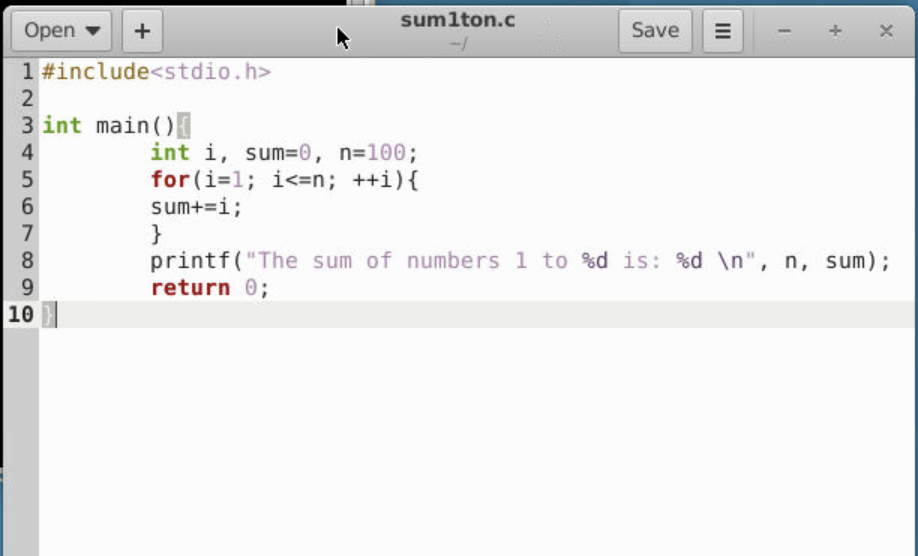


#### Creating the Source File using gedit in codespace

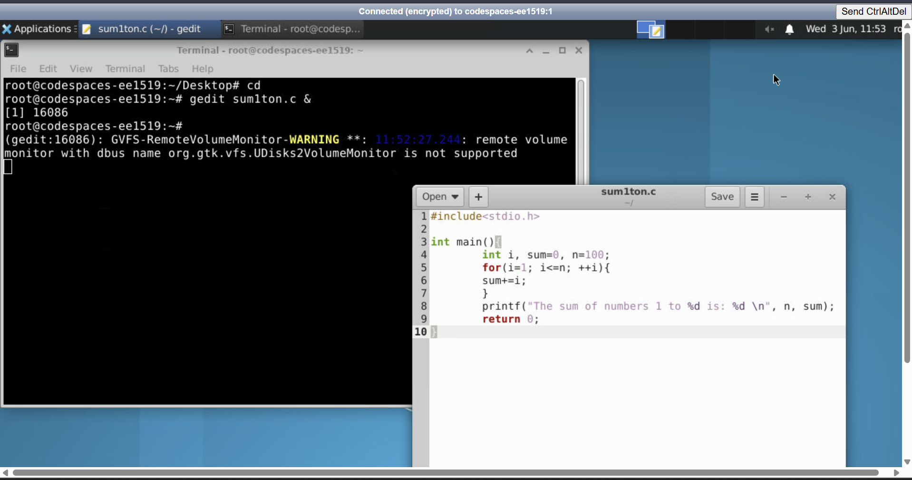


#### Creating the Source File using leafpad in virtual box

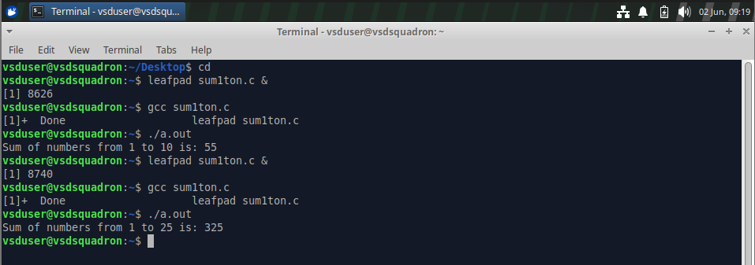


#### Program Execution

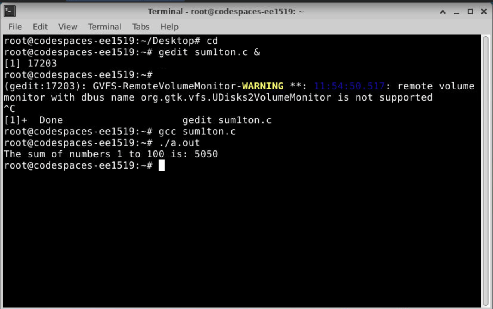

---

## Part 2: RISC-V Cross Compilation and Instruction Analysis

### Screenshot

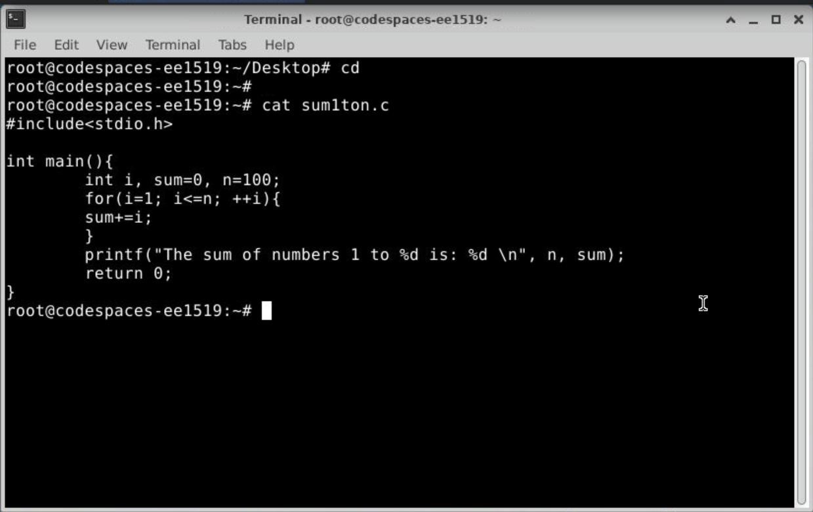


### Compilation Using -O1

```bash
riscv64-unknown-elf-gcc -O1 -mabi=lp64 -march=rv64i -o sum1ton.o sum1ton.c
```

### listed sum1ton.o
```bash
ls -ltr sum1ton.o
```

### Disassembly

```bash
riscv64-unknown-elf-objdump -d sum1ton.o
```

```bash
riscv64-unknown-elf-objdump -d sum1ton.o | less
```

### Screenshots

### O1 Assembly Output

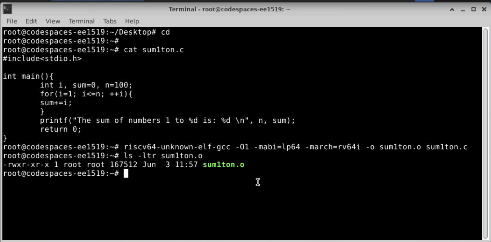

---

### Using `riscv64-unknown-elf-objdump -d sum1ton.o | less`

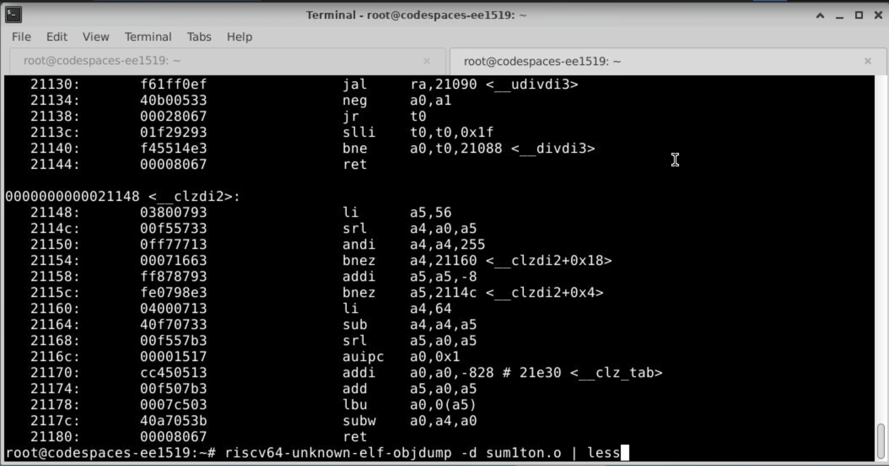

---

### Disassembly Output and searching for main using /main

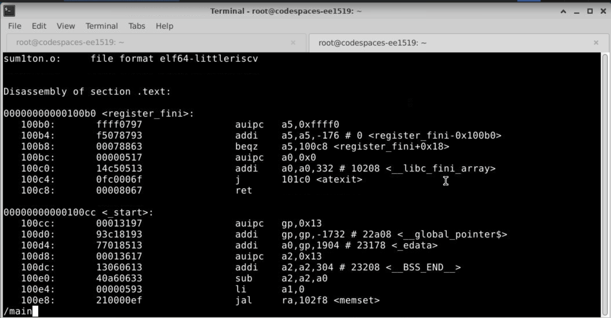

---

### RISC-V Assembly Code Generated from `sum1ton.c`


---

### Calculation 1


---

### Calculation 2 - Number of Instructions in the `main()` Function


---

### Compilation Using -Ofast

```bash
riscv64-unknown-elf-gcc -Ofast -mabi=lp64 -march=rv64i -o sum1ton.o sum1ton.c
```

### Disassembly

```bash
riscv64-unknown-elf-objdump -d sum1ton.o
```
```bash
riscv64-unknown-elf-objdump -d sum1ton.o | less
```


### Screenshots

### Ofast Assembly Output

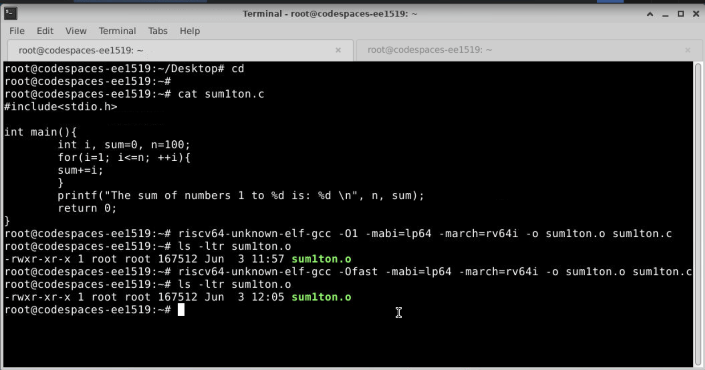

---

### Using `riscv64-unknown-elf-objdump -d sum1ton.o | less`

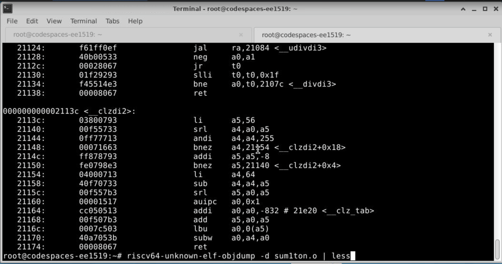

---

### Disassembly Output and searching for main using /main

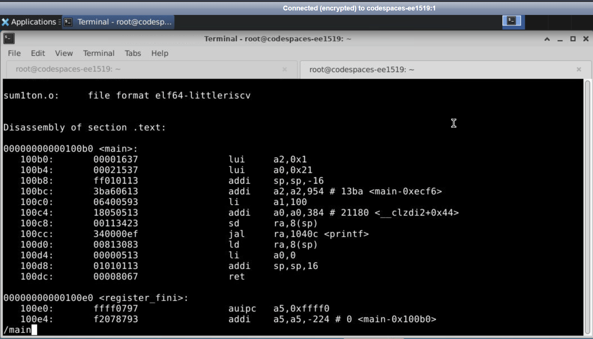

---

### RISC-V Assembly Code Generated from `sum1ton.c`


---

### Calculation 1


---

### Calculation 2 - Number of Instructions in the `main()` Function


---


### Viewing Large Assembly Output

```bash
riscv64-unknown-elf-objdump -d sum1ton.o | less
```

This command was used to navigate through the assembly output page by page.

---

## Instruction Count Comparison

| Optimization Level | Number of Instructions in `<main>` |
|-------------------|-------------------------------------|
| O1 | 15 |
| Ofast | 12 |

### Observation

The assembly generated using the `-Ofast` optimization level was more optimized compared to `-O1`. By comparing the number of instructions present in the `<main>` function, it was observed that compiler optimization can reduce instruction count significantly and improve execution efficiency.

---

## Comparative Analysis of `-O1` and `-Ofast`

| Parameter                          | `-O1`                                                    | `-Ofast`                                        |
| ---------------------------------- | -------------------------------------------------------- | ----------------------------------------------- |
| Optimization Level                 | Moderate optimization                                    | Aggressive optimization                         |
| Primary Objective                  | Improve performance while maintaining safe optimizations | Maximize execution speed                        |
| Number of Instructions in `<main>` | **15**                                                   | **12*                                          |
| Assembly Code Size                 | Larger                                                   | Smaller                                         |
| Generated Code Efficiency          | Moderate                                                 | Higher                                          |
| Compiler Optimization              | Basic optimization techniques                            | Advanced optimization techniques |


---

## Learning Outcomes

- Learned Linux file creation and editing using Leafpad/gedit.
- Understood the RISC-V cross-compilation flow.
- Generated assembly code using `objdump`.
- Analyzed compiler optimization effects.
- Compared instruction counts between different optimization levels.

</details>

---

# Task 2

<details>
<summary><b>Task 2: SPIKE Simulation and Debugging using RISC-V GCC</b></summary>

### 📄 Detailed Documentation - It is in the Task 2 folder of the repository

👉 **[Click here to view the Task 2 Documentation](Task2/README.md)**

This task focuses on understanding the complete RISC-V software development flow using the RISC-V GCC toolchain and the SPIKE RISC-V ISA simulator. It includes C program verification, RISC-V cross-compilation, simulation, debugging, and digital design application implementation.

---

### Task 2A: RISC-V Toolchain Setup, Compilation, Simulation and Instruction Analysis

This part focuses on exploring the complete RISC-V software execution flow, starting from a high-level C program and moving towards low-level instruction analysis.

It includes:

* Compilation and verification of a C program using GCC.
* Cross-compilation of the program using `riscv64-unknown-elf-gcc`.
* Execution of the generated RISC-V binary using the SPIKE RISC-V ISA simulator.
* Generation and analysis of RISC-V assembly instructions using Objdump.
* Instruction-level debugging using SPIKE debug mode.
* Understanding the working and format of RISC-V instructions such as LUI and ADDI.

---

### Task 2B: Digital Design Application using C

This part focuses on developing a digital design application in C and validating its functionality across the RISC-V software flow.

It includes:

* Designing and implementing a application using C programming.
* Functional verification of the application using the GCC compiler.
* Cross-compilation of the application for the RISC-V architecture.
* Execution and validation of the generated RISC-V binary using the SPIKE simulator..

</details>

---

# Task 3

<details>
<summary><b>Task 3: Environment Setup and RISC-V Reference Bring-Up</b></summary>

### 📄 Detailed Documentation - It is in the Task 3 folder of the repository

👉 **[Click here to view the Task 3 Documentation](Task3/README.md)**

This task focuses on establishing a complete RISC-V development environment and validating the software execution flow before moving towards FPGA and IP development. It includes GitHub Codespace setup, RISC-V toolchain verification, reference program execution, VSDFPGA firmware validation, and local development environment preparation.

---

### Task 3A: GitHub Codespace Setup and RISC-V Reference Flow

This part focuses on setting up the official RISC-V development environment and verifying the complete software execution flow.

It includes:

* Setting up the GitHub Codespace environment.
* Verifying the RISC-V GCC cross-compiler, SPIKE RISC-V ISA simulator, and Icarus Verilog.
* Compiling and executing the `sum1ton.c` RISC-V reference program.
* Modifying the reference program and validating the changed output.
* Understanding the RISC-V compilation and simulation flow.

---

### Task 3B: VSDFPGA Lab Execution and Local Environment Preparation

This part focuses on exploring the VSDFPGA repository, validating the firmware flow, and preparing the local development environment.

It includes:

* Cloning and exploring the `vsdfpga_labs` repository.
* Understanding the firmware structure and generating the BRAM HEX file.
* Executing the firmware using the SPIKE simulator.
* Studying the Docker environment and understanding required development tools.
* Preparing a local Ubuntu VirtualBox environment and cloning the required repositories.
* Understanding memory-mapped I/O and FPGA IP integration concepts.

</details>

---

# Task 4

<details>
<summary><b>Task 4: GPIO Peripheral Integration and Firmware Validation on a RISC-V SoC</b></summary>

### 📄 Detailed Documentation - It is in the Task 4 folder of the repository

👉 **[Click here to view the Task 4 Documentation](Task4/README.md)**

This task focuses on extending the RISC-V SoC by designing, integrating, and validating a custom GPIO (General Purpose Input/Output) peripheral. The complete hardware-software co-design flow was explored, starting from peripheral creation in Verilog, integration into the memory-mapped I/O subsystem, firmware development, and FPGA bitstream generation.

---

### Task 4A: Analysis of Existing Memory-Mapped Peripherals

This part focuses on understanding the existing SoC architecture and the mechanism used for communication between the processor and peripherals.

It includes:

* Studying the memory-mapped I/O architecture of the RISC-V SoC.
* Understanding RAM and I/O address decoding.
* Analyzing existing peripherals such as LEDs and UART.
* Understanding memory read and write transactions.
* Examining how peripherals are connected to the processor through the memory bus.
* Identifying the integration points required for adding a new peripheral.

---

### Task 4B: GPIO Peripheral Design and Integration

This part focuses on creating a custom GPIO peripheral and integrating it into the SoC memory map.

It includes:

* Designing a GPIO peripheral in Verilog.
* Implementing GPIO register storage logic.
* Supporting memory-mapped read operations.
* Supporting memory-mapped write operations.
* Adding a dedicated GPIO address space.
* Creating GPIO write-enable control logic.
* Instantiating the GPIO module inside the SoC.
* Extending the I/O read-data multiplexer to support GPIO reads.
* Verifying successful integration through RTL compilation.

---

### Task 4C: GPIO Firmware Development and Validation

This part focuses on developing firmware that communicates with the newly integrated GPIO peripheral.

It includes:

* Understanding the firmware build environment.
* Updating the memory-mapped I/O definitions in `io.h`.
* Creating a dedicated GPIO test application.
* Performing GPIO write operations from software.
* Performing GPIO read operations from software.
* Verifying correct GPIO functionality through read-back validation.
* Generating firmware executable and HEX memory images.

---

### Task 4D: FPGA Build Flow and Bitstream Generation and GTKWaveform generation

This part focuses on rebuilding the complete RISC-V SoC after GPIO integration and generating the FPGA programming file.

It includes:

* Compiling the modified hardware design using Yosys.
* Performing place-and-route using nextpnr-ice40.
* Running timing analysis using icetime.
* Generating FPGA configuration files.
* Creating the final FPGA bitstream (`SOC.bin`).
* Verifying successful synthesis and timing closure.
* Confirming that the GPIO integration does not violate the original timing requirements of the design.

---

### Key Outcomes

* Successfully designed a custom GPIO peripheral.
* Integrated GPIO into the memory-mapped I/O subsystem.
* Implemented software-controlled GPIO read/write functionality.
* Generated firmware images for the RISC-V processor.
* Successfully synthesized the modified SoC.
* Achieved timing closure at the target clock frequency.
* Generated a valid FPGA bitstream (`SOC.bin`) for deployment on the VSDSquadron FPGA Mini board.

</details>

---


## 👩‍💻 Author

**Sonali**

ECE, The LNMIIT Jaipur
