# Task 2 - Part A  
## RISC-V Toolchain Setup, Compilation, Simulation and Instruction Analysis

## Objective

The objective of this task is to understand the complete RISC-V software flow by taking a simple C program, compiling it using the native GCC compiler, cross-compiling it for the RISC-V architecture, executing it on the Spike RISC-V simulator, and analyzing the generated RISC-V assembly instructions.

---

## Applications and Tools Used

### 1. GCC Compiler
GNU Compiler Collection (GCC) is used to compile and execute the C program on the host machine to verify its functionality.

### 2. RISC-V GCC Cross Compiler
`riscv64-unknown-elf-gcc` is used to convert the C source code into a RISC-V executable binary. It generates machine instructions that can be executed on a RISC-V processor.

### 3. Spike RISC-V ISA Simulator
Spike is the official RISC-V ISA simulator. It simulates the execution of RISC-V binaries and allows observation of instruction execution and register changes.

### 4. RISC-V Objdump
`riscv64-unknown-elf-objdump` is used to disassemble the RISC-V executable and display the generated assembly instructions.

---

# Step 1: C Program Verification Using GCC

A simple C program was used to calculate the sum of numbers from 1 to 100 using a loop. The program was compiled and executed using GCC to verify that it works correctly before performing RISC-V cross compilation.

C Program:

```c
#include<stdio.h>

int main()
{
    int i, sum = 0, n = 100;

    for(i = 1; i <= n; i++)
    {
        sum += i;
    }

    printf("The sum of numbers 1 to %d is: %d\n", n, sum);

    return 0;
}
```

Compilation command:

```bash
gcc sum1ton.c
```

Execution command:

```bash
./a.out
```

Output:

```
The sum of numbers 1 to 100 is: 5050
```

### Screenshot

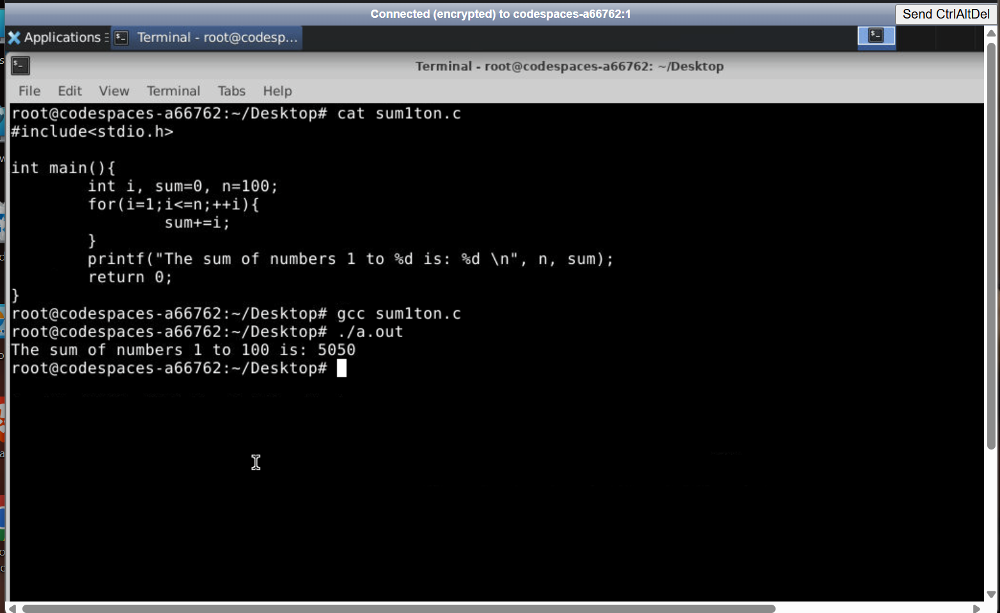

---

# Step 2: Cross Compiling for RISC-V Architecture

The C program was cross compiled using the RISC-V GCC compiler.

Command used:

```bash
riscv64-unknown-elf-gcc -Ofast -mabi=lp64 -march=rv64i -o sum1ton.o sum1ton.c
```

Explanation of flags:

- `-Ofast` : Enables aggressive compiler optimizations.
- `-mabi=lp64` : Specifies the LP64 ABI where long integers and pointers are 64-bit.
- `-march=rv64i` : Generates instructions for the RISC-V 64-bit base integer ISA.
- `-o sum1ton.o` : Specifies the output executable file.

### Screenshot

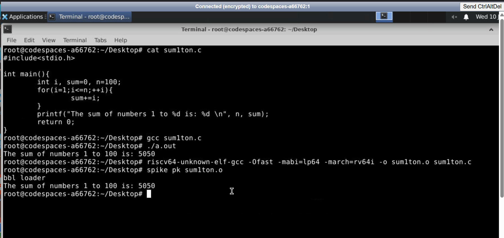

---

# Step 3: Executing the RISC-V Binary Using Spike

The generated RISC-V executable was executed using the Spike simulator.

Command:

```bash
spike pk sum1ton.o
```

Where:

- `spike` is the RISC-V ISA simulator.
- `pk` is the Proxy Kernel used to provide basic runtime support.

Output:

```
bbl loader

The sum of numbers 1 to 100 is: 5050
```

The same output confirms that the RISC-V binary executes correctly.

### Screenshot


---

# Step 4: Generating RISC-V Assembly Code

The generated executable was disassembled using `objdump`.

Command:

```bash
riscv64-unknown-elf-objdump -d sum1ton.o | less
```

This displays the RISC-V assembly instructions corresponding to the C program.

### Screenshot

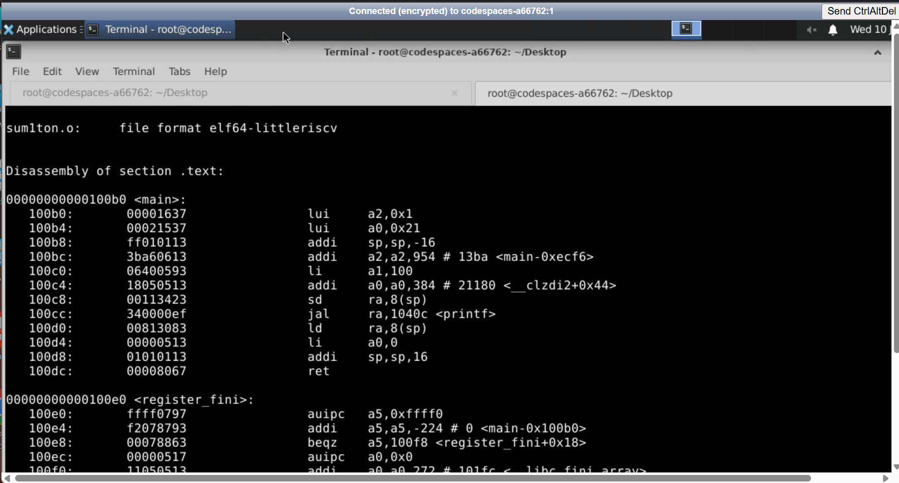

---

# Step 5: Debugging Instructions Using Spike

Spike debug mode was enabled using:

```bash
spike -d pk sum1ton.o
```

The debugger was instructed to stop at the beginning of the `main()` function:

```bash
until pc 0 100b0
```

The contents of a register can be checked using:

```bash
reg 0 a2
```

Initially, the value of register `a2` was:

```
0x0000000000000000
```

After executing one instruction:

```bash
reg 0 a2
```

The value changed to:

```
0x0000000000001000
```

This confirms that the instruction modified the register value.

### Screenshot

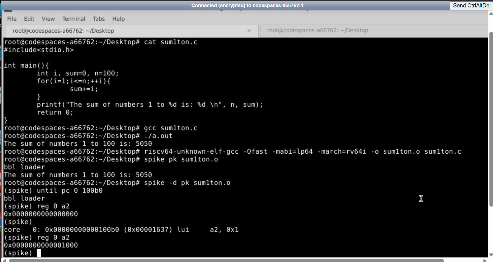

---

# Step 6: Analysis of LUI (Load Upper Immediate) Instruction

The first instruction observed was:

```assembly
lui a2, 0x1
```

LUI loads a 20-bit immediate value into the upper 20 bits of the destination register and fills the lower 12 bits with zeros.

Operation:

```
a2 = 0x1 << 12
```

Therefore:

```
a2 = 0x0000000000001000
```

This matches the value observed in Spike.

### Screenshot

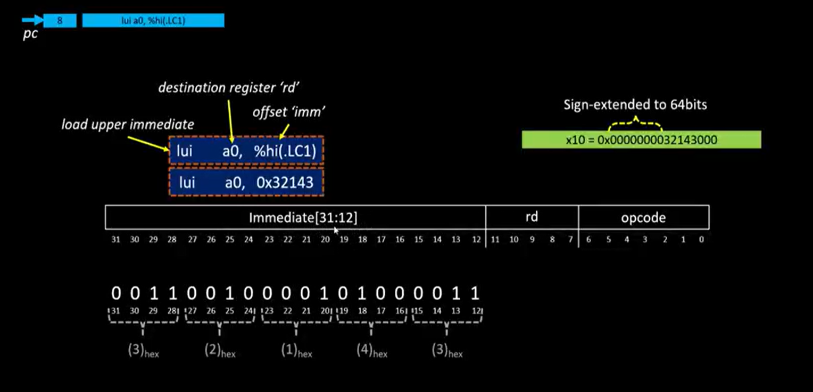

---

# Step 7: Analysis of ADDI Instruction and Stack Pointer Update

The next instruction analyzed was:

```assembly
addi sp, sp, -16
```

ADDI adds an immediate value to a source register and stores the result in the destination register.

Before execution:

```
sp = 0x000000007f7e9b50
```

After execution:

```
sp = 0x000000007f7e9b40
```

Since:

```
0x7f7e9b50 - 0x10 = 0x7f7e9b40
```

The result confirms the operation of the instruction.

### Screenshot

Register value verification:

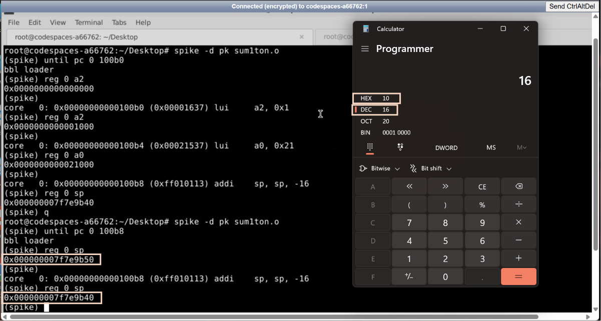

Hexadecimal calculation verification:

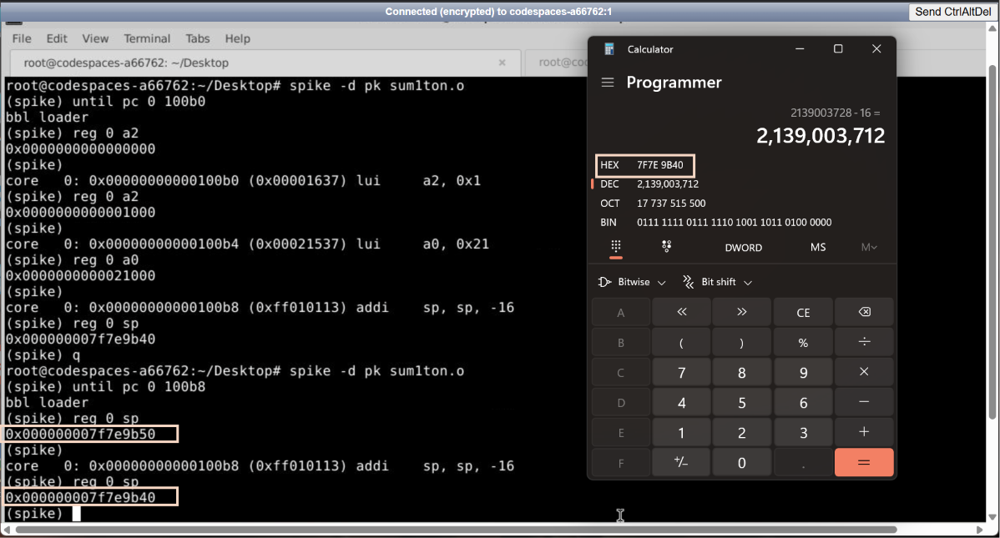

ADDI instruction format analysis:

The ADDI instruction follows the RISC-V I-type instruction format. It consists of a 12-bit immediate field, source register (`rs1`), function code (`funct3`), destination register (`rd`), and opcode. The immediate value is sign-extended and added to the value stored in the source register.

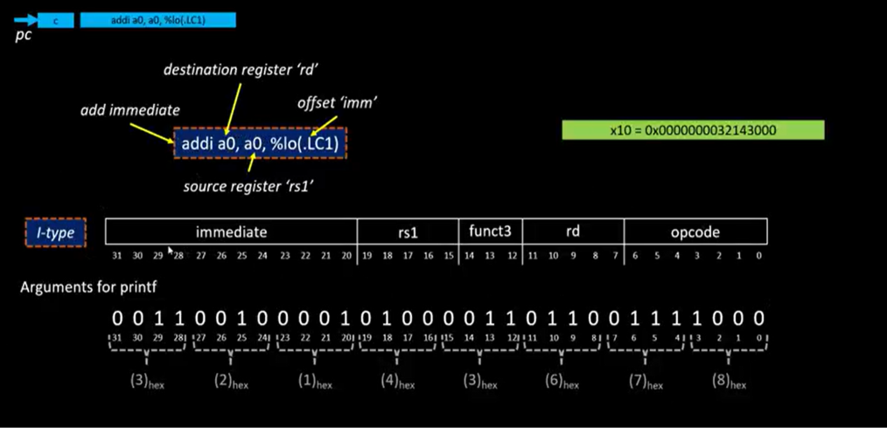

---

# Conclusion

This task demonstrated the complete RISC-V software execution flow starting from a high-level C program to low-level instruction analysis.

The following concepts were understood:

- C program compilation using GCC.
- Cross-compilation using RISC-V GCC.
- Execution of RISC-V binaries using the Spike simulator.
- Generation and analysis of RISC-V assembly instructions.
- Instruction-level debugging using Spike.
- Working of RISC-V instructions such as LUI and ADDI.
- Understanding of RISC-V instruction formats and register modifications during execution.

This provides a foundation for understanding how high-level C code is translated into RISC-V machine instructions and executed by a processor.


---

# Task 2B: RISC-V Compilation, Disassembly and Debugging of Digital Lock System

## Objective

The objective of this task is to design and implement a Digital Lock System in C, verify its functionality, compile it for the RISC-V architecture, analyze the generated assembly instructions, and debug the program execution using the Spike RISC-V simulator.

The task demonstrates how a high-level C application is translated into low-level RISC-V instructions and how processor registers and memory are affected during execution.

---

# Digital Lock System C Application

The following C program implements a Digital Lock System using a Finite State Machine (FSM). The system provides password authentication, password modification, system locking, and security lockdown after multiple failed login attempts.

```c
#include <stdio.h>

#define PASSWORD_LENGTH 4
#define MAX_ATTEMPTS 3

//FSM States
typedef enum{
    LOCKED,
    VERIFY,
    ACCESS_GRANTED,
    ACCESS_DENIED,
    LOCKDOWN,
    EXIT
} State;


//Registers (Hardware like variables)
int password[PASSWORD_LENGTH] = {1,2,3,4};
int entered[PASSWORD_LENGTH];

int attempts = 0;
State current_state = LOCKED;


//Function to take password input
void enter_password(){
    int choice;

    printf("\n1. Enter Password");
    printf("\n0. Exit\n");
    printf("Enter Choice: ");
    scanf("%d", &choice);

    if(choice == 0){
        current_state = EXIT;
        return;
    }

    printf("\n Enter %d digit password: ", PASSWORD_LENGTH);

    char input[5];
    scanf("%4s", input);

    for(int i = 0; i < PASSWORD_LENGTH; i++){
        entered[i] = input[i] - '0';
    }

    current_state = VERIFY;
}


//Compare entered password with stored password
int check_password(){
    for(int i = 0; i < PASSWORD_LENGTH; i++){
        if(entered[i] != password[i]){
            return 0;
        }
    }

    return 1;
}


//Change password feature
void change_password(){
    char input[PASSWORD_LENGTH + 1];

    printf("\nEnter new %d digit password: ", PASSWORD_LENGTH);
    scanf("%4s", input);

    for(int i = 0; i < PASSWORD_LENGTH; i++){
        password[i] = input[i] - '0';
    }

    printf("Password changed successfully\n");
}


//Handle successful login
void access_granted(){
    int choice;

    printf("Access granted\n");
    printf("door unlocked\n");

    attempts = 0;

    printf("\n1. Lock System\n");
    printf("2. Change password\n");
    printf("Enter Choice:");
    scanf("%d", &choice);

    if(choice == 2){
        change_password();
    }

    current_state = LOCKED;
}


//Handle failed login
void access_denied(){
    attempts++;

    printf("Access denied\n");

    if(attempts >= MAX_ATTEMPTS){
        current_state = LOCKDOWN;
    }
    else{
        printf("Attempts left: %d\n", MAX_ATTEMPTS - attempts);
        current_state = LOCKED;
    }
}


//Lockdown state
void system_lockdown(){
    int reset;

    printf("Security Alert\n");
    printf("System Lockdown\n");
    printf("System will now shut down\n");

    current_state = EXIT;
}


//Main FSM controller
int main(){

    printf("DIGITAL LOCK SYSTEM\n");

    while(1){

        switch(current_state){

            case LOCKED:
                enter_password();
                break;

            case VERIFY:
                if(check_password()){
                    current_state = ACCESS_GRANTED;
                }
                else{
                    current_state = ACCESS_DENIED;
                }
                break;


            case ACCESS_GRANTED:
                access_granted();
                break;


            case ACCESS_DENIED:
                access_denied();
                break;


            case LOCKDOWN:
                system_lockdown();
                break;


            case EXIT:
                printf("\nExisting Digital Lock System...\n");
                return 0;
        }
    }

    return 0;
}
```

---

# 1. Testing the Digital Lock System Application

The C program was first compiled and executed using the GCC compiler to verify that all functionalities of the Digital Lock System were working correctly.

Compilation command:

```bash
gcc digitallock.c
```

Execution command:

```bash
./a.out
```

The following features were tested:

- Successful password authentication.
- Door unlocking after correct password entry.
- Locking the system after access.
- Changing the existing password.
- Verifying the newly changed password.
- Exiting the application.
- Security lockdown after three incorrect password attempts.

### Screenshots

Successful login and locking the system:

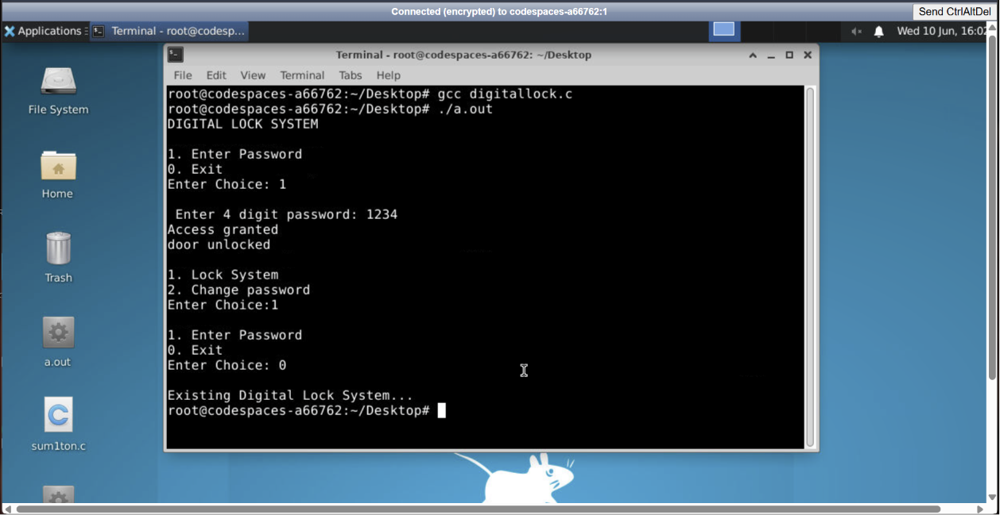

Security lockdown after three incorrect attempts:

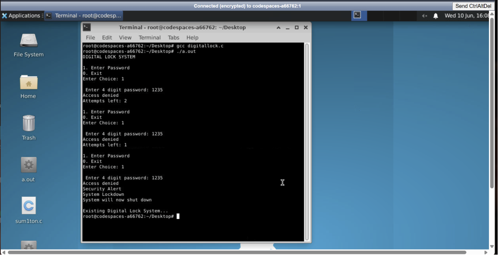

Changing password and verifying the new password:

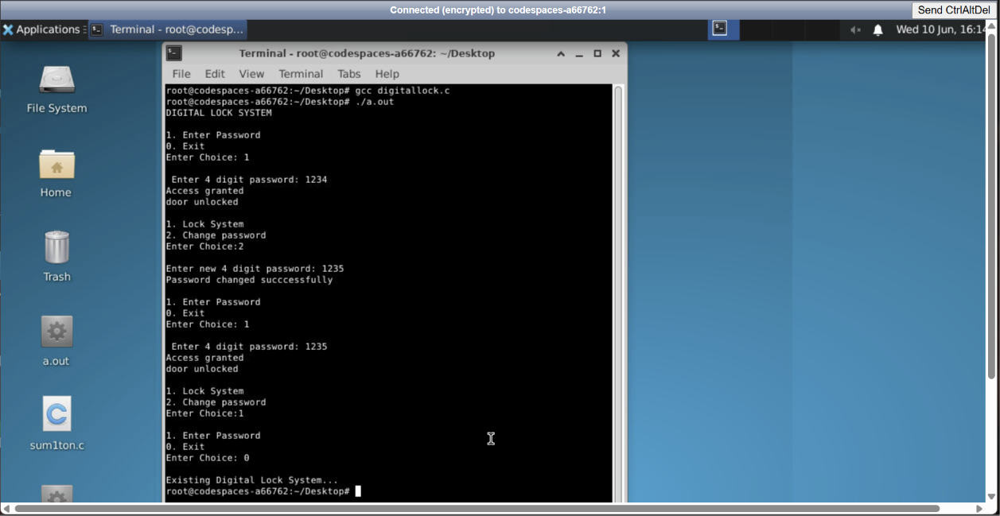

---

# 2. Compiling the Application for RISC-V Architecture

After verifying the application functionality, the C program was cross-compiled for the RISC-V architecture using the RISC-V GCC compiler.

Compilation command:

```bash
riscv64-unknown-elf-gcc -O1 -mabi=lp64 -march=rv64i -o digitallock.o digitallock.c
```
### Explanation of Compilation Options

- `riscv64-unknown-elf-gcc`  
  This is the RISC-V cross compiler used to generate executable machine code for a RISC-V processor.

- `-O1`  
  Enables basic compiler optimizations while keeping the generated assembly relatively easy to understand and analyze.

- `-mabi=lp64`  
  Specifies the RISC-V ABI (Application Binary Interface) where:
  - `long` data type is 64 bits.
  - Pointers are 64 bits.
  - General-purpose registers are 64 bits wide.

- `-march=rv64i`  
  Specifies that the generated machine code should follow the base 64-bit RISC-V integer instruction set.

- `-o digitallock.o`  
  Specifies the name of the generated output executable file.

### Screenshot

RISC-V compilation using GCC:

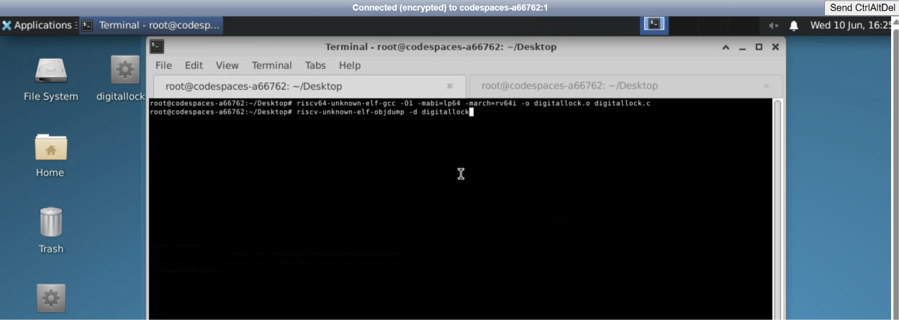

---

# 3. Generating RISC-V Assembly Code Using objdump

After generating the RISC-V executable, the assembly code was obtained using the `objdump` utility.

Command used:

```bash
riscv64-unknown-elf-objdump -d digitallock.o | less
```

### Explanation

- `objdump` is a tool used to display information about object and executable files.
- The `-d` option disassembles the executable sections and converts machine instructions into readable RISC-V assembly instructions.
- `less` allows the assembly output to be viewed page by page inside the terminal.

The disassembly output contains:

- Memory addresses of instructions.
- Machine code represented in hexadecimal format.
- Corresponding RISC-V assembly instructions.
- Function names and branch targets.

### Screenshots

The main function obtained after objdump by -O1:

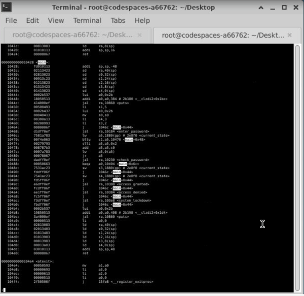

calculation of instructions:

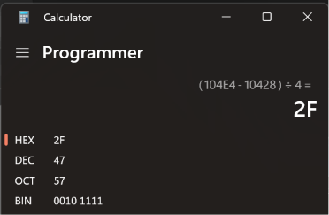


---


# 4. Compiling the Program with Higher Optimization Level

The Digital Lock System application was also compiled using the `-Ofast` optimization level.

Command used:

```bash
riscv64-unknown-elf-gcc -Ofast -mabi=lp64 -march=rv64i -o digitallock.o digitallock.c
```

### Explanation of `-Ofast`

`-Ofast` enables aggressive compiler optimizations to improve execution speed.

Compared to `-O1`, the compiler may:

- Reorder instructions.
- Remove unnecessary operations.
- Optimize loops and function calls.
- Generate faster but more complex assembly code.

Initial:

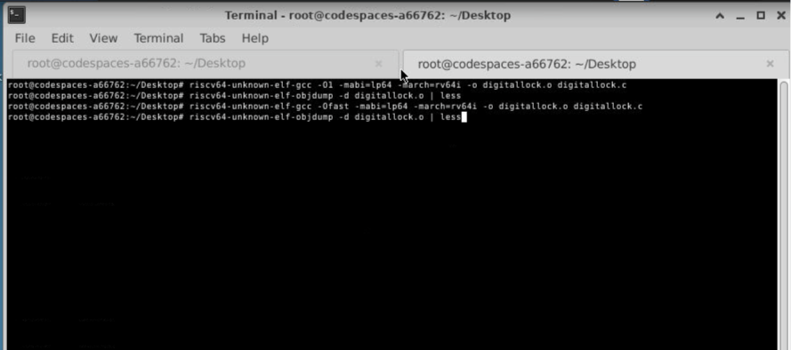

### Initial Assembly Analysis

The beginning of the `main` function appears as:

```assembly
100b0: lui   a0, 0x2b
100b4: addi  sp, sp, -64
100b8: addi  a0, a0, 656
```

### Explanation of Instructions

#### 1. `lui a0, 0x2b`

The `lui` (Load Upper Immediate) instruction loads an immediate value into the upper 20 bits of the register.

Before execution:

```
a0 = 0x0000000000000001
```

After execution:

```
a0 = 0x000000000002b000
```

This instruction is generally used to build addresses of strings or global data.

---

#### 2. `addi sp, sp, -64`

The `addi` instruction subtracts 64 bytes from the stack pointer.

Before execution:

```
sp = 0x0000007f7e9b50
```

After execution:

```
sp = 0x0000007f7e9b10
```

Difference:

```
0x7f7e9b50 - 0x7f7e9b10 = 0x40
```

Since:

```
0x40 hexadecimal = 64 decimal
```

the program allocates 64 bytes of stack memory for local variables and saving registers inside the `main` function.

---

#### 3. `addi a0, a0, 656`

This instruction adds the immediate value `656` to the current value stored in `a0`.

Before execution:

```
a0 = 0x000000000002b000
```

After execution:

```
a0 = 0x000000000002b290
```

This completes the formation of the memory address of a string or global variable.


### Screenshot

Compilation with `-Ofast` optimization:

Disassembly with `-Ofast` optimization (Part A):

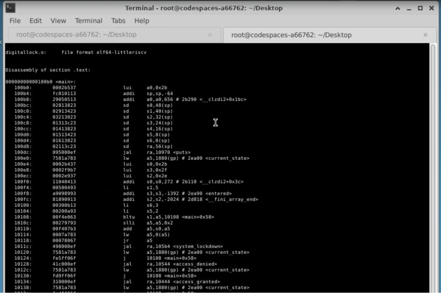

Disassembly with `-Ofast` optimization (Part B):

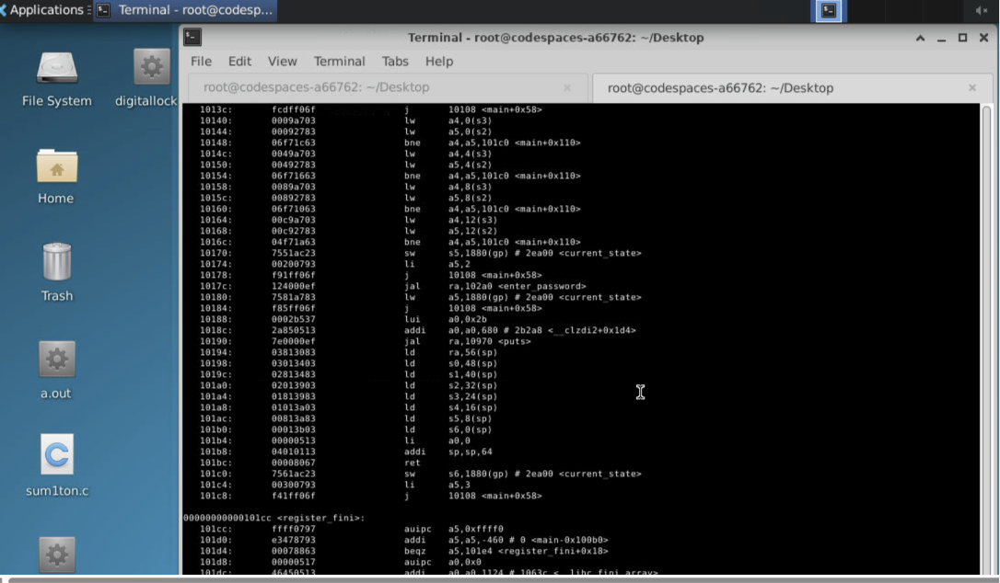

calculation of instructions:

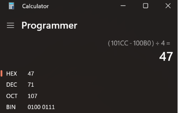


---

# 5. Executing the Program Using Spike RISC-V Simulator

After successful compilation, the generated RISC-V executable was executed using the Spike simulator to verify that the Digital Lock System runs correctly on the RISC-V architecture.

Command used:

```bash
spike pk digitallock.o
```

### Explanation of the Command

- `spike` is the RISC-V ISA simulator that emulates the execution of RISC-V programs.
- `pk` refers to the Proxy Kernel, which provides a minimal runtime environment and handles basic system calls such as input and output.
- `digitallock.o` is the RISC-V executable generated using the cross compiler.

The execution output confirmed that all functionalities of the Digital Lock System worked correctly on the simulated RISC-V environment.

### Screenshot

Execution of the Digital Lock System using Spike:

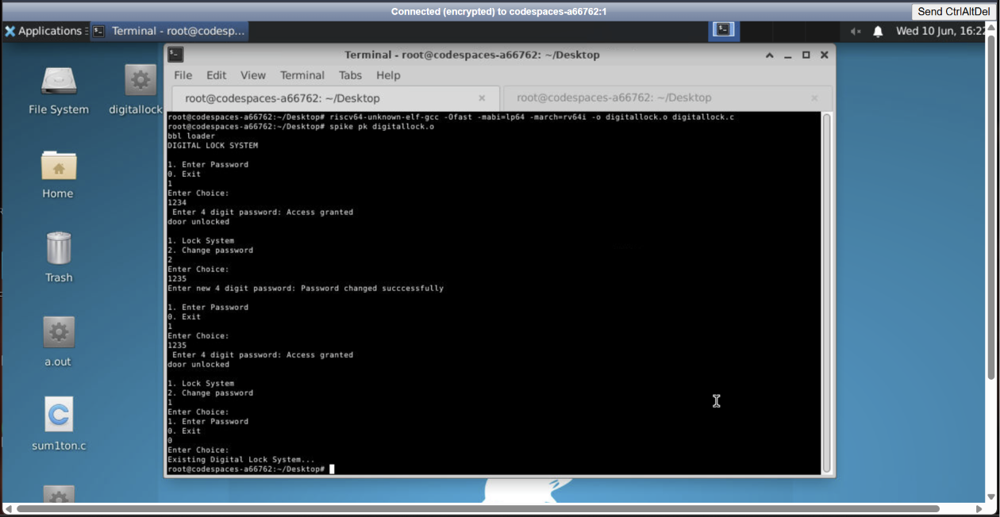

---

# 6. Starting the Spike Interactive Debugger

To analyze the execution of the program at the instruction level, the Spike simulator was started in debugging mode.

Command used:

```bash
spike -d pk digitallock.o
```

The `-d` option enables interactive debugging, allowing the user to:

- Execute instructions step-by-step.
- Observe changes in processor registers.
- Analyze the effect of individual assembly instructions.
- Monitor the flow of execution using the program counter.

### Screenshot

Starting the Spike debugger:

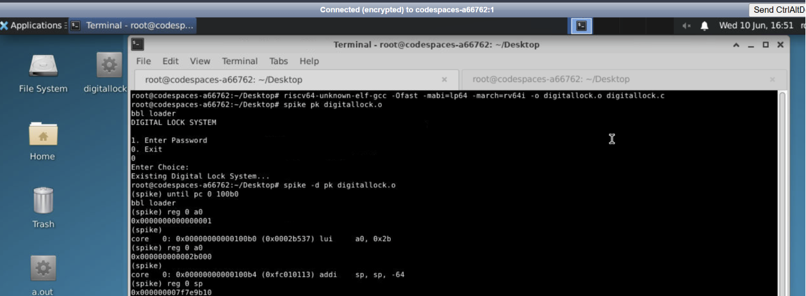

---

# 7. Moving Execution to the Main Function

When the debugger starts, the program begins execution from the initial boot code. To directly reach the beginning of the `main` function, the following command was used:

```bash
until pc 100b0
```

Here:

- `until` runs the program continuously until a specified condition is met.
- `pc` refers to the Program Counter register.
- `100b0` is the memory address where the `main` function starts.

After reaching the required address, the debugger stops and displays the instruction located at the beginning of `main`.

Example output:

```assembly
core 0: 0x00000000000100b0 (0x0002b537) lui a0, 0x2b
```

This indicates that the next instruction to be executed is the `lui` instruction.

---

# 8. Register Analysis Using the Spike Debugger

main
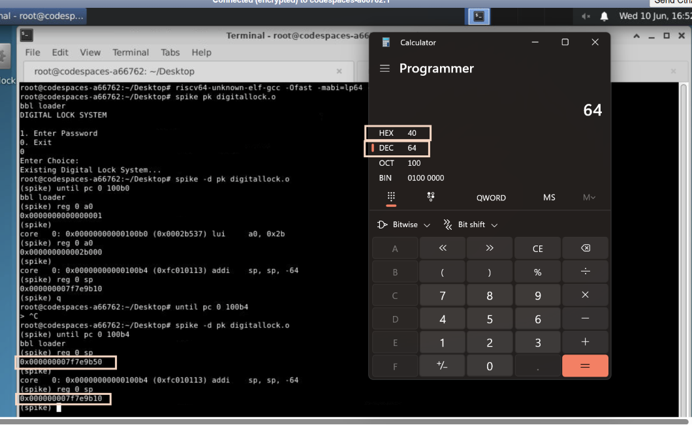


The values stored inside processor registers can be examined using the `reg` command.

Command:

```bash
reg 0 a0
```

Here:

- `0` represents the CPU core number.
- `a0` is the register whose value is being inspected.

Initially, the value of `a0` was:

```
0x0000000000000001
```

After executing the `lui a0, 0x2b` instruction, the value changed to:

```
0x000000000002b000
```

This verifies the operation of the `lui` instruction, which loads an immediate value into the upper portion of the register.

### Screenshot

Observation of `a0` register before and after execution:


---

# 9. Stack Pointer (`sp`) Analysis

The stack pointer was analyzed to observe the effect of the following instruction:

```assembly
addi sp, sp, -64
```

The `sp` register was checked using:

```bash
reg 0 sp
```

Before executing the instruction:

```
sp = 0x0000007f7e9b50
```

After executing the instruction:

```
sp = 0x0000007f7e9b10
```

The difference between the two values is:

```
0x7f7e9b50 - 0x7f7e9b10 = 0x40
```

Since:

```
0x40 hexadecimal = 64 decimal
```

the stack pointer moved downward by 64 bytes. This confirms that the `main` function allocated 64 bytes of stack space for storing local variables and saving registers.

### Screenshot

Stack pointer analysis:

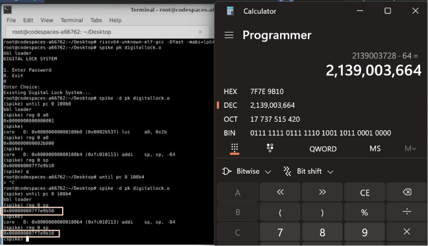

---

# Conclusion

In this task, an Advanced Digital Lock System application written in C was successfully compiled for the RISC-V architecture using the RISC-V cross compiler.

The generated machine code was disassembled using `objdump` to study the corresponding RISC-V assembly instructions. Different optimization levels such as `-O1` and `-Ofast` were used to observe the effect of compiler optimizations on the generated assembly.

The program was then executed using the Spike RISC-V simulator. Using the Spike interactive debugger, execution was controlled at the instruction level, and important registers such as `a0` and `sp` were examined to understand how individual instructions modify processor state.

The experiment demonstrates the complete workflow of converting a high-level C application into RISC-V machine code, executing it on a simulated processor, and analyzing the low-level behavior of the program through debugging.
