# Task 3: Environment Setup & RISC-V Reference Bring-Up

## Objective

The objective of this task was to establish a stable RISC-V development environment, verify the RISC-V software toolchain, execute a reference RISC-V program, run the VSDFPGA basic firmware, and prepare a local Linux development environment for future FPGA and IP development.

This task follows the standard engineering workflow of:
- Environment setup
- Toolchain verification
- Reference design execution
- Firmware validation
- Local development preparation

---

# Development Environment

The task was completed using two environments:

### 1. GitHub Codespaces

GitHub Codespaces was used as the primary cloud-based Linux environment. The official `vsd-riscv2` repository was forked and launched successfully.

The Codespace provided a pre-configured environment containing the RISC-V toolchain, Spike RISC-V simulator, Icarus Verilog simulator, and supporting development tools.

---

### 2. RISC-V Toolchain Verification

The following tools were verified inside the Codespace environment:

- RISC-V GCC Cross Compiler
- Spike RISC-V ISA Simulator
- Icarus Verilog Simulator

---

## RISC-V GCC Verification

The GCC cross-compiler was verified using:

```bash
riscv64-unknown-elf-gcc --version
```

This compiler converts C source code into executable binaries for the RISC-V architecture.

### Screenshot

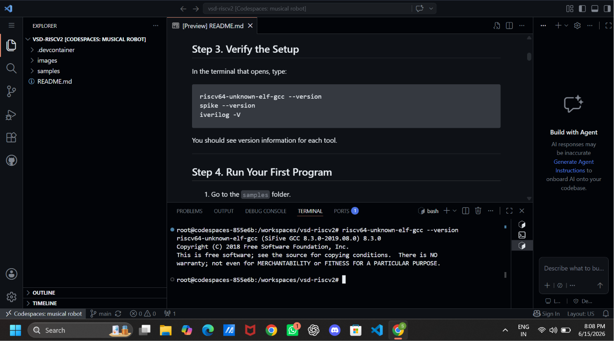

---

## Spike RISC-V Simulator Verification

The installed version of Spike did not support the `--version` option. Therefore, the `--help` command was used to confirm successful installation.

Commands used:

```bash
spike --version
spike --help
```

Spike is an ISA-level simulator that executes RISC-V binaries in a virtual RISC-V environment.

### Screenshot

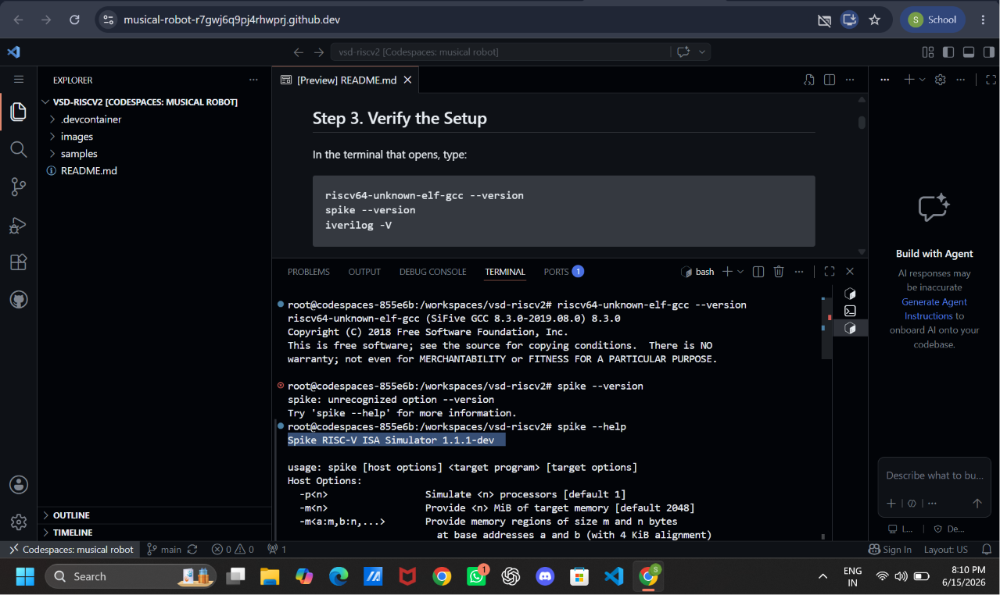

---

## Icarus Verilog Verification

Icarus Verilog was verified using:

```bash
iverilog -V
```

Icarus Verilog is a Verilog compiler and simulator used for RTL verification and simulation.

### Screenshot

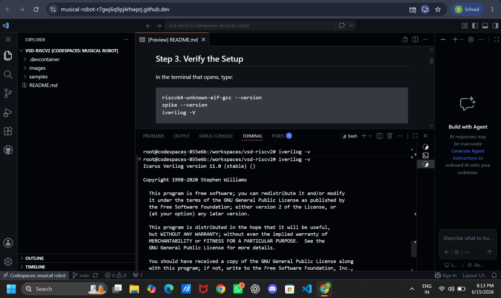

---

# Running the RISC-V Reference Program

The `sum1ton.c` program available inside the `samples` directory of the `vsd-riscv2` repository was used as the first reference RISC-V program.

The program was compiled using:

```bash
riscv64-unknown-elf-gcc -o sum1ton.o sum1ton.c
```

The generated executable was run on the Spike simulator using:

```bash
spike pk sum1ton.o
```

Successful execution confirmed that the complete RISC-V compilation and simulation flow was working correctly.

### Expected Output

```
bbl loader
Sum from 1 to 9 is 45
```

### Screenshot

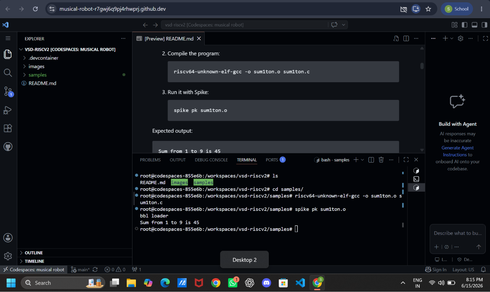

---

# Optional Confidence Task: Modifying the RISC-V Program

As an additional verification step, the original `sum1ton.c` program was modified by changing the value of the constant `n`.

The modified program was rebuilt using the RISC-V cross compiler and executed again using the Spike simulator.

The modified output was:

```
bbl loader
Sum from 1 to 100 is 5050
```

This confirmed that changes made to the source code were successfully compiled and reflected during execution.

### Screenshot

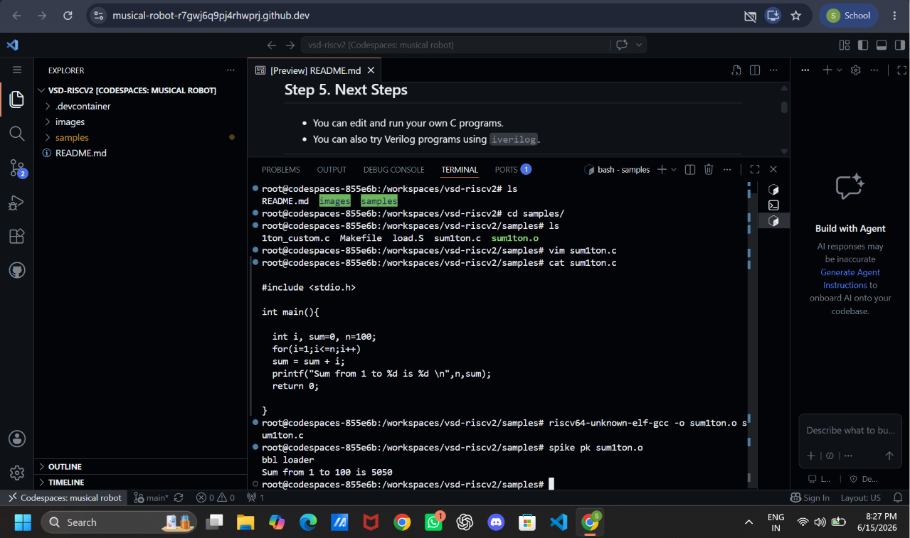

---

# VSDFPGA Lab Setup

After successfully verifying the reference RISC-V flow, the `vsdfpga_labs` repository was cloned inside the same GitHub Codespace environment.

Commands used:

```bash
git clone https://github.com/vsdip/vsdfpga_labs.git
cd vsdfpga_labs
```

This step established a multi-repository development workflow similar to a real FPGA and SoC development environment.

### Screenshot

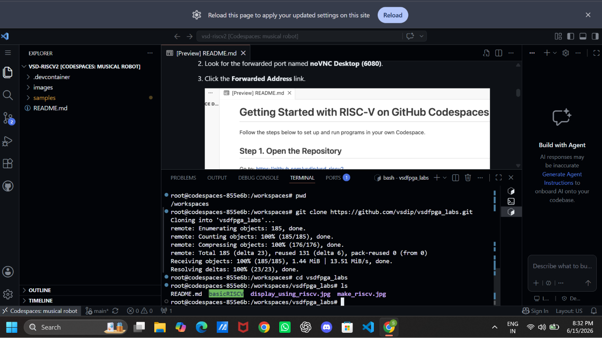

---

# Exploring the Basic RISC-V Firmware

The `basicRISCV` firmware provided in the `vsdfpga_labs` repository was explored.

The firmware directory contains the main RISC-V source files, linker scripts, startup files, libraries, and supporting files required for generating firmware for the VSDSquadron FPGA platform.

Firmware location:

```text
vsdfpga_labs/basicRISCV/Firmware
```

The source file `riscv_logo.c` was examined to understand the program responsible for generating the VSDSquadron FPGA Mini display output.

### Screenshot

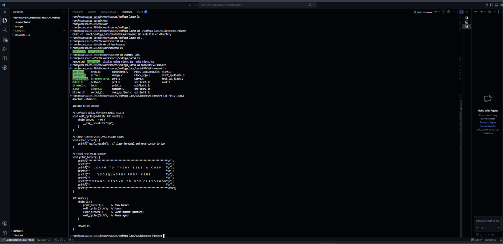

---

# Building the BRAM Firmware Image

The firmware was converted into a Block RAM (BRAM) memory initialization file using the provided Makefile.

Command used:

```bash
make riscv_logo.bram.hex
```

The build process compiled the required RISC-V source files, linked them into an executable, and generated the `riscv_logo.bram.hex` file.

This HEX file can be loaded into the FPGA Block RAM so that the RISC-V processor can execute the firmware after FPGA configuration.

### Screenshot

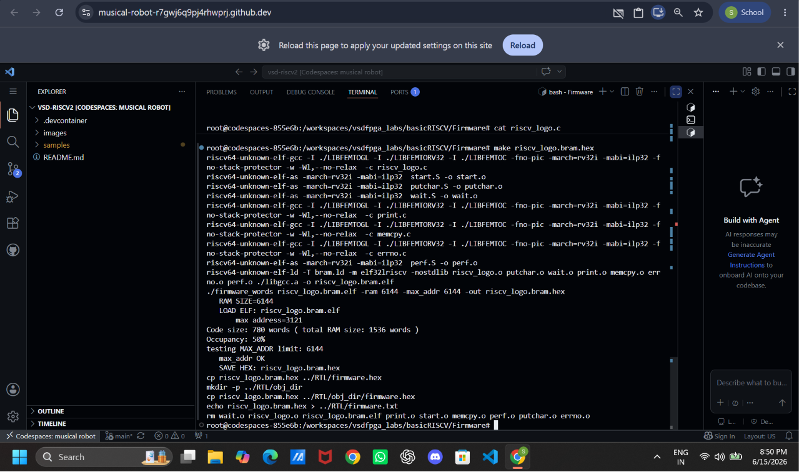

---

# Executing Firmware on Spike RISC-V Simulator

To validate the firmware before running it on physical hardware, the `riscv_logo.c` program was compiled into a RISC-V ELF executable and executed using the Spike simulator.

Commands used:

```bash
riscv64-unknown-elf-gcc -o riscv_logo.elf riscv_logo.c

spike pk riscv_logo.elf
```

The output displayed the VSDSquadron FPGA Mini banner repeatedly, confirming successful execution of the firmware in the simulated RISC-V environment.

### Screenshot

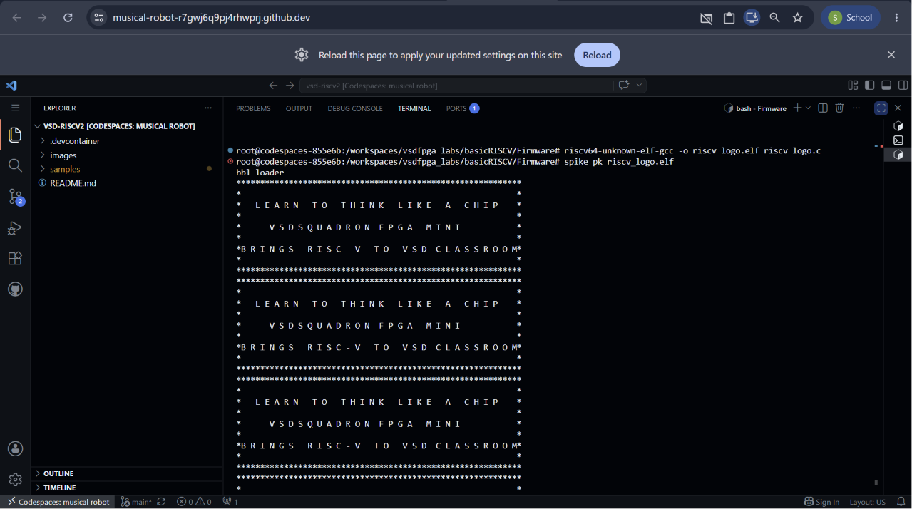

---
# Local Machine Preparation Using Oracle VirtualBox

Apart from the cloud-based GitHub Codespace environment, a local Linux development environment was also prepared using Oracle VirtualBox with Ubuntu.

The purpose of this setup was to prepare a standalone development environment for future FPGA development tasks and understand the dependencies required for RISC-V development.

A dedicated workspace named `riscv_projects` was created and the required repositories were cloned locally.

Commands used:

```bash
mkdir ~/riscv_projects
cd ~/riscv_projects

git clone https://github.com/vsdip/vsd-riscv2.git
git clone https://github.com/vsdip/vsdfpga_labs.git

ls
```

The final workspace structure was:

```text
riscv_projects
├── vsd-riscv2
└── vsdfpga_labs
```

### Screenshot

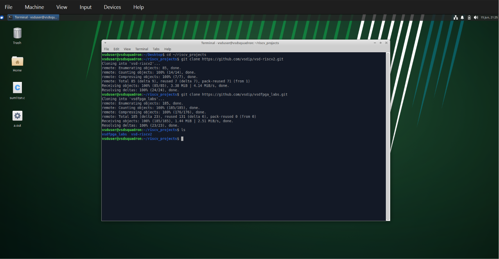

---

# Exploring Local VSDFPGA Repository Structure

The cloned `vsdfpga_labs` repository was explored locally to understand its directory structure, including the `basicRISCV` project and its RTL components.

Important directories observed:

- `basicRISCV/Firmware` - Contains RISC-V firmware source files, linker scripts, and supporting libraries.
- `basicRISCV/RTL` - Contains Verilog RTL files implementing the hardware design.

This provided an understanding of how software firmware and hardware RTL coexist in an FPGA-based RISC-V system.

### Screenshot

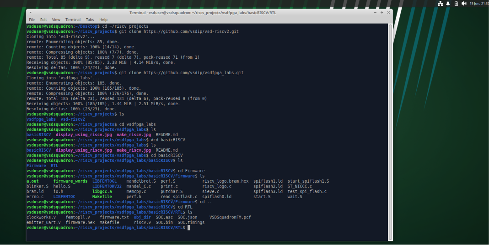

---

# Understanding Questions

## 1. Where is the RISC-V program located in the `vsd-riscv2` repository?

The reference RISC-V program is located inside the `samples` directory of the `vsd-riscv2` repository. During this task, the program sum1ton.c was used to verify the RISC-V execution flow.


```text
vsd-riscv2/
└── samples/
    └── sum1ton.c
```

---

## 2. How is the RISC-V program compiled and loaded into memory?

The program is compiled using the RISC-V GCC cross compiler (`riscv64-unknown-elf-gcc`) which converts C code into a RISC-V executable ELF file.

The generated ELF file is then loaded by the Proxy Kernel (`pk`) and executed by the Spike RISC-V ISA simulator.

The complete flow is: C source code → RISC-V compiler → ELF executable → Proxy Kernel → Spike simulator → program execution.


---

## 3. How does the RISC-V core access memory and memory-mapped I/O?

The RISC-V processor accesses the memory and peripherals using load and store instructions.

Every memory location and hardware peripheral is assigned a specific address range and when the processor accesses a normal memory address, it communicates with RAM. When the processor accesses an address, the operation is treated as memory-mapped I/O

Examples of memory-mapped peripherals:

- UART communication modules
- GPIO interfaces
- Timers
- Custom FPGA IP blocks

This mechanism allows software running on the RISC-V core to control external hardware using ordinary memory read and write operations.

---

## 4. Where would a new FPGA IP block logically integrate in this system?

A new FPGA IP block would be integrated as a memory-mapped peripheral connected to the system bus.

The RISC-V processor would communicate with this IP block through dedicated address locations by performing the read and write operations.


---

# Understanding the Docker Environment

The Dockerfile provided with the project was studied to understand how the complete RISC-V development environment is configured.

The Docker environment includes:

- Ubuntu 22.04 as the base operating system.
- GCC and general development tools.
- RISC-V cross-compilation toolchain.
- Spike RISC-V ISA simulator.
- RISC-V Proxy Kernel (`pk`).
- Icarus Verilog and GTKWave for Verilog simulation and waveform analysis.
- Required libraries and environment variable configuration.

Studying the Dockerfile helped in understanding the software dependencies required for a reproducible FPGA and RISC-V development environment.

---

# Conclusion

In this task, a complete RISC-V development workflow was successfully established.

The work included:

- Setting up and using GitHub Codespaces.
- Verifying the RISC-V GCC toolchain, Spike simulator, and Icarus Verilog.
- Compiling and executing a reference RISC-V program.
- Modifying and validating the program through the complete compile-execute cycle.
- Exploring the VSDFPGA repository and firmware structure.
- Generating FPGA BRAM initialization files.
- Running firmware using the Spike simulator.
- Preparing a local Ubuntu VirtualBox development environment.
- Understanding the relationship between RISC-V software, memory, peripherals, and FPGA IP integration.

This task provided a strong foundation for upcoming FPGA IP development tasks by demonstrating the complete flow from software development to hardware-oriented firmware preparation.

---
