# Task 4: Design & Integrate Your First Memory-Mapped IP

## Step 1: Understanding the Existing SoC

### Objective

Before designing and integrating a new GPIO IP, it is essential to understand the existing RISC-V System-on-Chip (SoC) architecture. The objective of this step is to analyze the current design, identify how memory-mapped peripherals are connected, understand the processor's read/write mechanism, and locate existing peripherals that can be used as references for future IP integration.

---

## Repository Exploration

The `vsdfpga_labs` repository was explored to locate the RTL (Register Transfer Level) source files responsible for implementing the RISC-V processor and SoC.

### RTL Files Identified

```text
basicRISCV/RTL/
├── femtopll.v
├── riscv.v
├── clockworks.v
└── emitter_uart.v
```

### Screenshot

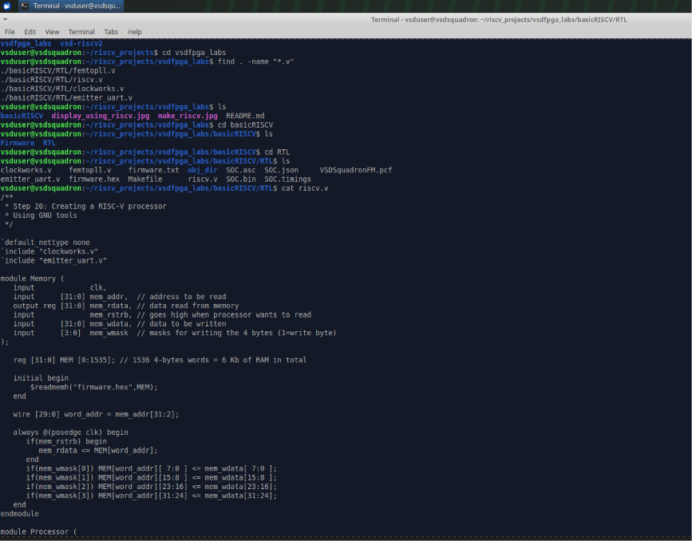

---

## Studying the Main SoC File

The `riscv.v` file was identified as the primary integration file of the SoC.

This file contains:

- Processor instantiation
- Memory interface
- Address decoding logic
- Memory-mapped I/O implementation
- LED peripheral integration
- UART peripheral integration

### Screenshot

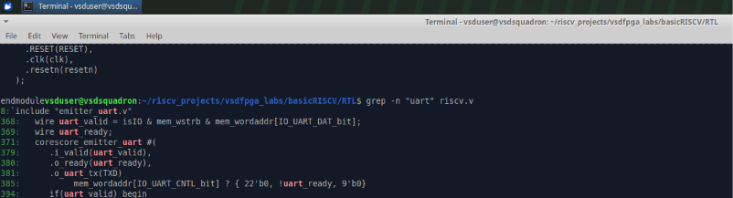

---

## Understanding Memory Access Mechanism

The memory subsystem is implemented using a dedicated `Memory` module.

### Important Memory Signals

| Signal | Description |
|----------|-------------|
| `mem_addr` | Address generated by the CPU |
| `mem_rdata` | Data returned to the CPU |
| `mem_wdata` | Data written by the CPU |
| `mem_wmask` | Byte-wise write mask |
| `mem_wstrb` | Write enable signal |

These signals form the communication interface between the processor and memory/peripherals.

### Screenshot

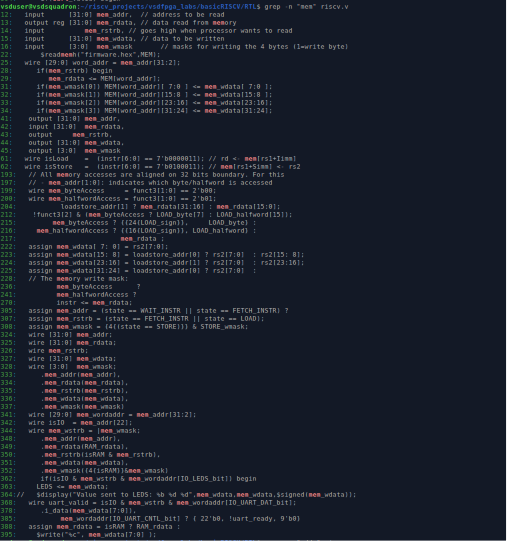

---

## Address Decoding Logic

The following logic was identified inside `riscv.v`:

```verilog
wire isIO  = mem_addr[22];
wire isRAM = !isIO;
```

### Explanation

The SoC uses address bit 22 to distinguish between RAM accesses and I/O accesses.

- If `mem_addr[22] = 0`, the processor accesses RAM.
- If `mem_addr[22] = 1`, the processor accesses memory-mapped I/O peripherals.

This mechanism allows peripherals to appear as memory locations from the processor's perspective.

### Screenshot

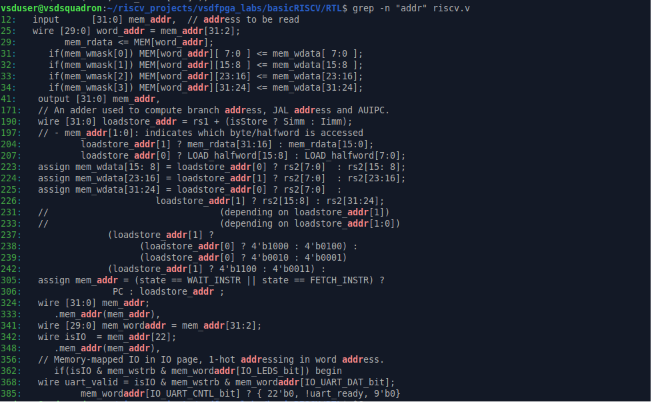

---

## Existing Memory-Mapped Peripherals


The following memory-mapped I/O locations were identified:

| I/O Location | Purpose |
|--------------|----------|
| IO_LEDS_bit | LED output register |
| IO_UART_DAT_bit | UART transmit data register |
| IO_UART_CNTL_bit | UART control/status register |

These locations collectively implement two peripherals:

1. LED Peripheral
2. UART Peripheral

### LED Peripheral

The LED peripheral is identified using:

```verilog
localparam IO_LEDS_bit = 0;
```

The LED register is updated whenever the processor performs a write operation to the corresponding I/O address.

```verilog
always @(posedge clk) begin
    if(isIO && mem_wstrb && mem_wordaddr[IO_LEDS_bit]) begin
        LEDS <= mem_wdata;
    end
end
```

### Working

1. CPU places the target address on `mem_addr`.
2. CPU places the data on `mem_wdata`.
3. Address decoder identifies the LED peripheral.
4. LED register is updated with the written value.

---

### UART Peripheral

The UART peripheral is identified using:

```verilog
localparam IO_UART_DAT_bit = 1;
```

UART transmission is initiated using:

```verilog
wire uart_valid =
    isIO &
    mem_wstrb &
    mem_wordaddr[IO_UART_DAT_bit];
```

The UART transmitter is implemented using the `emitter_uart.v` module.

### Working

1. CPU writes data to the UART address.
2. UART receives the data.
3. UART serially transmits the information through the TX line.

### Screenshot

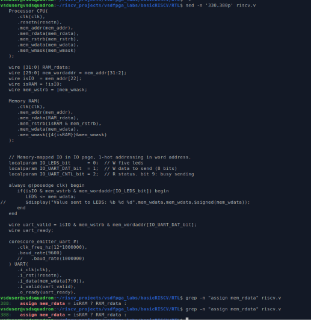

---

## Understanding Write Operations

Write operations are controlled using:

```verilog
wire mem_wstrb = |mem_wmask;
```

### Write Flow

```text
CPU
 │
 ├── mem_addr
 ├── mem_wdata
 └── mem_wstrb
        │
        ▼
 Address Decoder
        │
        ▼
 Selected Peripheral
        │
        ▼
 Register Update
```

Whenever `mem_wstrb` is active, the selected peripheral receives the data available on `mem_wdata`.

---

## Understanding Read Operations

Read operations return data through:

```verilog
assign mem_rdata = isRAM ? RAM_rdata : IO_rdata;
```

### Explanation

- For RAM accesses, data is returned from `RAM_rdata`.
- For I/O accesses, data is returned from `IO_rdata`.

### Read Flow

```text
CPU Requests Address
          │
          ▼
     Address Decoder
          │
   ┌──────┴──────┐
   │             │
 RAM          I/O Device
   │             │
   ▼             ▼
RAM_rdata    IO_rdata
      \       /
       \     /
        ▼   ▼
      mem_rdata
          │
          ▼
         CPU
```

This mechanism enables peripherals to provide data back to the processor during read operations.

---

## SoC Architecture Overview

```text
                 +----------------+
                 |   RISC-V CPU   |
                 +----------------+
                         |
                         |
                    Memory Bus
                         |
          --------------------------------
          |                              |
          |                              |
        RAM                           I/O Space
                                         |
                           -------------------------
                           |                       |
                         LEDs                   UART
```

---

## Key Findings

### Peripheral Decoding

Peripheral decoding is implemented inside `riscv.v` using:

```verilog
wire isIO = mem_addr[22];
```

and peripheral-specific address selection logic.

---

### CPU Write Interface

The processor performs write operations using:

```verilog
mem_addr
mem_wdata
mem_wmask
mem_wstrb
```

---

### CPU Read Interface

The processor performs read operations using:

```verilog
mem_rdata
```

which returns either RAM data or I/O data depending on the target address.

---

### Existing Peripherals Identified

The following memory-mapped peripherals were identified:

- LED Peripheral
- UART Peripheral

These peripherals serve as references for integrating future IP blocks into the SoC.

---

## Relevance

The GPIO IP specified in Task 2 will be integrated into the same memory-mapped I/O framework used by the existing LED and UART peripherals.

The new GPIO peripheral will:

- Contain a 32-bit register
- Accept write operations from the CPU
- Return the stored value during read operations
- Be connected through the existing memory bus
- Use the same address decoding mechanism already present in the SoC

---
---

# Step 2: GPIO IP RTL Design

## Objective

After understanding the existing SoC architecture and memory-mapped I/O mechanism in Step 1, the next objective was to design a new GPIO (General Purpose Input Output) IP block.

The GPIO IP must satisfy the requirements specified in the task:

- Implement a 32-bit register
- Store data written by the CPU
- Return the stored value during read operations
- Expose the stored value through an output signal

This GPIO IP will later be integrated into the existing RISC-V SoC as a memory-mapped peripheral.

---

## Understanding the GPIO IP Requirements

The task specifies a simple memory-mapped GPIO peripheral consisting of a single 32-bit register.

### Write Operation

When the processor writes data to the GPIO address:

```text
CPU → GPIO Register
```

the register should store the received value.

Example:

```text
CPU writes: 0x00000055

GPIO Register = 0x00000055
```

---

### Read Operation

When the processor reads from the GPIO address:

```text
CPU ← GPIO Register
```

the previously stored value should be returned.

Example:

```text
GPIO Register = 0x00000055

CPU reads → 0x00000055
```

---

### GPIO Output

The stored register value should also be continuously available on an output signal.

```text
GPIO Output = GPIO Register Value
```

---

## Creating the GPIO RTL File

A new RTL module named `gpio.v` was created inside the RTL directory.

### Commands Used

```bash
cd ~/riscv_projects/vsdfpga_labs/basicRISCV/RTL
touch gpio.v
```

### Screenshot

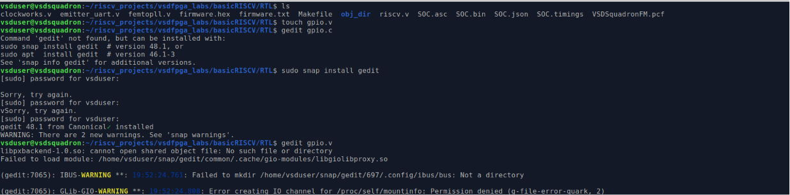

---

## Studying Existing RTL Coding Style

Before writing the GPIO module, the existing UART implementation (`emitter_uart.v`) was studied to understand the coding style used throughout the repository.

Observations:

- Inputs use the prefix `i_`
- Outputs use the prefix `o_`
- Sequential logic uses `always @(posedge clk)`
- Hardware modules follow a simple and consistent RTL style

### Screenshot

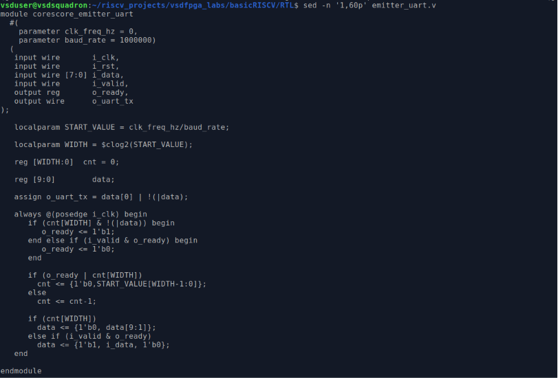

---

## GPIO Module Design

The GPIO module was designed using the same coding style as the existing RTL files.

### GPIO RTL Source Code

```verilog
module gpio (

    input wire         i_clk,
    input wire         i_rst,

    input wire         i_we,
    input wire [31:0]  i_wdata,

    output wire [31:0] o_rdata,
    output wire [31:0] o_gpio

);

reg [31:0] gpio_reg;

always @(posedge i_clk) begin

    if(i_rst)
        gpio_reg <= 32'b0;

    else if(i_we)
        gpio_reg <= i_wdata;

end

assign o_rdata = gpio_reg;
assign o_gpio  = gpio_reg;

endmodule
```

### Screenshot

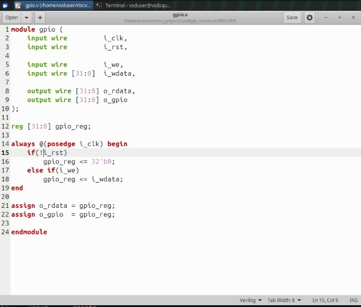

---

## Module Interface Description

### Input Signals

| Signal | Width | Description |
|----------|----------|-------------|
| `i_clk` | 1 bit | System clock |
| `i_rst` | 1 bit | Reset signal |
| `i_we` | 1 bit | Write enable signal |
| `i_wdata` | 32 bits | Data written into GPIO register |

---

### Output Signals

| Signal | Width | Description |
|----------|----------|-------------|
| `o_rdata` | 32 bits | Data returned during read operations |
| `o_gpio` | 32 bits | GPIO output value |

---

## Internal Register Storage

The GPIO IP contains a single 32-bit register:

```verilog
reg [31:0] gpio_reg;
```

This register serves as the storage element for the peripheral.

### Purpose

- Stores data written by the CPU
- Provides data during read operations
- Drives the GPIO output signal

---

## Write Logic

The write functionality is implemented using sequential logic:

```verilog
always @(posedge i_clk) begin

    if(i_rst)
        gpio_reg <= 32'b0;

    else if(i_we)
        gpio_reg <= i_wdata;

end
```

### Operation

1. The register is cleared when reset is asserted.
2. On every positive clock edge:
   - If `i_we` is active, the incoming data is stored.
3. If `i_we` is inactive, the register retains its previous value.

### Data Flow

```text
CPU
 │
 ├── i_wdata
 └── i_we
        │
        ▼
   GPIO Register
```

---

## Readback Logic

The readback path is implemented using:

```verilog
assign o_rdata = gpio_reg;
```

### Operation

Whenever the processor performs a read operation, the contents of the GPIO register are presented on `o_rdata`.

### Data Flow

```text
GPIO Register
      │
      ▼
   o_rdata
      │
      ▼
     CPU
```

---

## GPIO Output Logic

The GPIO output is generated using:

```verilog
assign o_gpio = gpio_reg;
```

### Operation

The GPIO output always reflects the current contents of the register.

Example:

```text
CPU writes 100

gpio_reg = 100

o_gpio = 100
```

### Data Flow

```text
GPIO Register
      │
      ▼
    o_gpio
```

---

## Verification of GPIO RTL File

After completing the module, the contents of `gpio.v` were verified using:

```bash
cat gpio.v
```

### Screenshot

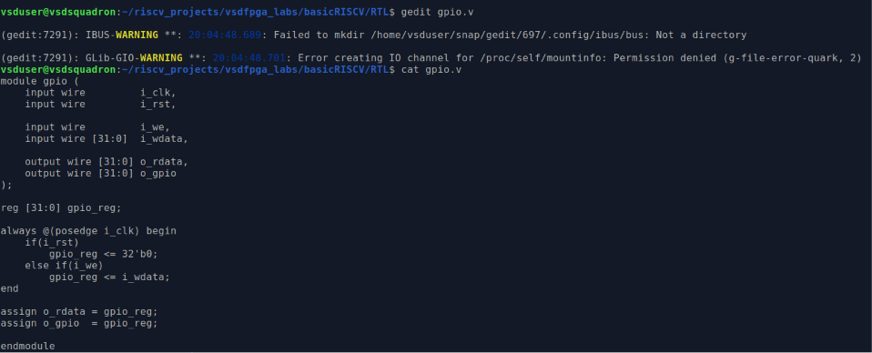

---

## Preparation for SoC Integration

Before modifying the SoC, a backup of the original `riscv.v` file was created.

### Command Used

```bash
cp riscv.v riscv_backup.v
```

This backup ensures that the original design can be restored if required during integration and debugging.

### Screenshot

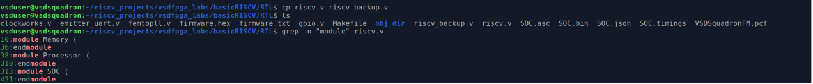

---

## Understanding the Existing Peripheral Readback Path

Before integrating the GPIO peripheral into the SoC, the existing I/O readback mechanism was examined.

The following logic was identified inside `riscv.v`:

```verilog
wire [31:0] IO_rdata =
       mem_wordaddr[IO_UART_CNTL_bit] ?
       {22'b0, !uart_ready, 9'b0}
       : 32'b0;

assign mem_rdata =
       isRAM ? RAM_rdata :
               IO_rdata;
```

### Screenshot

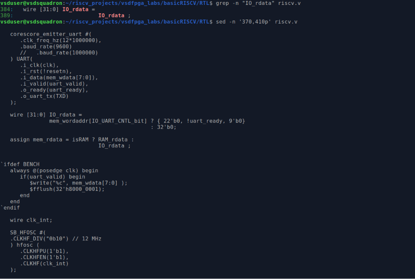

### Analysis

The signal `IO_rdata` represents the data returned from memory-mapped peripherals.

Currently, the UART Control Register is capable of returning status information to the processor through this path.

The signal `mem_rdata` acts as the final read-data bus seen by the processor.

### Read Data Selection

```text
CPU Read Request
        │
        ▼
 Address Decoder
        │
   ┌────┴────┐
   │         │
 RAM       I/O
   │         │
   ▼         ▼
RAM_rdata  IO_rdata
      \     /
       \   /
        ▼ ▼
      mem_rdata
          │
          ▼
         CPU
```

### Importance for GPIO Integration

The future GPIO peripheral must support readback functionality as required by the task specification.

To achieve this, the GPIO register value will eventually be connected to the `IO_rdata` path during SoC integration.

This analysis provided an understanding of how peripheral data is returned to the processor and prepared the design for the upcoming integration stage.

---

## Step 2 Summary

The GPIO RTL module was successfully designed and implemented.

### Features Implemented

✔ 32-bit Register Storage

✔ Write Enable Logic

✔ Reset Logic

✔ Readback Functionality

✔ GPIO Output Signal

✔ RTL Verification

### Generated Files

| File | Purpose |
|--------|----------|
| `gpio.v` | GPIO peripheral RTL implementation |
| `riscv_backup.v` | Backup of original SoC RTL before integration |

The GPIO IP is now ready to be connected to the existing memory-mapped I/O subsystem of the RISC-V SoC during the integration phase.

---

---

# Step 3: GPIO IP Integration into the RISC-V SoC

## Objective

After designing the GPIO IP in Step 2, the next objective was to integrate the peripheral into the existing RISC-V SoC.

The integration process involved:

- Adding the GPIO module to the SoC
- Assigning a dedicated memory-mapped address
- Creating GPIO write-enable logic
- Connecting GPIO signals to the system bus
- Instantiating the GPIO module
- Extending the readback path
- Verifying successful integration

The goal was to make the GPIO accessible to the processor using the same memory-mapped I/O mechanism already used by the LED and UART peripherals.

---

## Understanding the Integration Process

Prior to integration, the SoC contained the following memory-mapped peripherals:

```text
CPU
 │
 ├── RAM
 ├── LED Peripheral
 ├── UART Data Register
 └── UART Control Register
```

After integration, the architecture becomes:

```text
CPU
 │
 ├── RAM
 ├── LED Peripheral
 ├── UART Data Register
 ├── UART Control Register
 └── GPIO Peripheral
```

The GPIO peripheral is connected to the same memory bus and address decoding mechanism used by the existing peripherals.

---

## Including the GPIO Module

To allow the SoC to recognize the newly created GPIO module, the GPIO source file was included in `riscv.v`.

### Added Statement

```verilog
`include "gpio.v"
```

### Updated Include Section

```verilog
`default_nettype none

`include "clockworks.v"
`include "emitter_uart.v"
`include "gpio.v"
```

### Screenshot

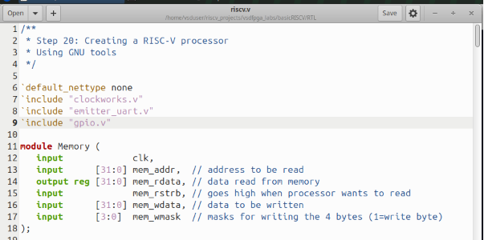

### Purpose

This inclusion allows the compiler to locate and compile the GPIO module during synthesis and simulation.

---

## Assigning a Memory-Mapped Address

The existing SoC already contained three memory-mapped I/O locations:

```verilog
localparam IO_LEDS_bit      = 0;
localparam IO_UART_DAT_bit  = 1;
localparam IO_UART_CNTL_bit = 2;
```

A new GPIO address was added:

```verilog
localparam IO_GPIO_bit = 3;
```

### Screenshot

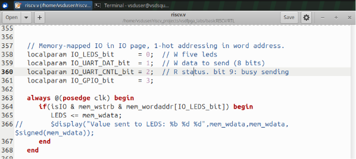

### Address Map

| Address Bit | Peripheral |
|-------------|------------|
| 0 | LED Register |
| 1 | UART Data Register |
| 2 | UART Control Register |
| 3 | GPIO Register |

### Purpose

This assigns a unique address to the GPIO peripheral, allowing the processor to access it independently.

---

## Creating GPIO Control Signals

Additional signals were introduced to support communication between the SoC and the GPIO module.

### Added Signals

```verilog
wire gpio_we;
wire [31:0] gpio_rdata;
wire [31:0] gpio_out;
```

### Screenshot

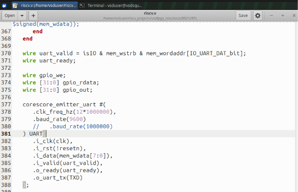

### Signal Description

| Signal | Purpose |
|----------|----------|
| `gpio_we` | GPIO write-enable signal |
| `gpio_rdata` | Data returned during read operations |
| `gpio_out` | GPIO output signal |

---

## Implementing GPIO Write Enable Logic

A dedicated write-enable signal was created for the GPIO peripheral.

### Logic Added

```verilog
assign gpio_we =
    isIO &
    mem_wstrb &
    mem_wordaddr[IO_GPIO_bit];
```

### Screenshot

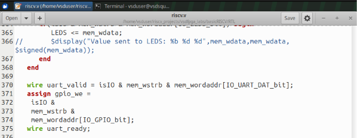

### Operation

The GPIO register is updated only when:

1. The access targets I/O space (`isIO`)
2. The processor performs a write operation (`mem_wstrb`)
3. The GPIO address is selected (`mem_wordaddr[IO_GPIO_bit]`)

### Write Flow

```text
CPU Write Request
        │
        ▼
 Address Decoder
        │
        ▼
 GPIO Address Selected
        │
        ▼
 gpio_we = 1
        │
        ▼
 GPIO Register Updated
```

---

## Instantiating the GPIO Module

After creating the required signals, the GPIO module was instantiated inside the SoC.

### GPIO Instantiation

```verilog
gpio GPIO (

    .i_clk(clk),
    .i_rst(resetn),

    .i_we(gpio_we),
    .i_wdata(mem_wdata),

    .o_rdata(gpio_rdata),
    .o_gpio(gpio_out)

);
```

### Screenshot

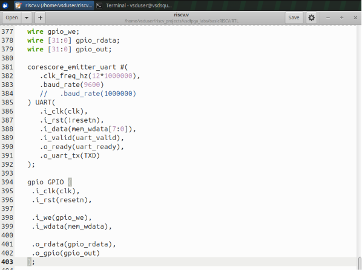

### Purpose

This connects the GPIO module to:

- Clock signal
- Reset signal
- Memory write data bus
- GPIO write enable logic
- Readback path

---

## Extending the Peripheral Readback Path

Prior to GPIO integration, the readback path only supported UART status information.

### Original Logic

```verilog
wire [31:0] IO_rdata =
    mem_wordaddr[IO_UART_CNTL_bit] ?
    {22'b0, !uart_ready, 9'b0}
    : 32'b0;
```

To support GPIO read operations, the logic was extended.

### Updated Logic

```verilog
wire [31:0] IO_rdata =
    mem_wordaddr[IO_GPIO_bit] ?
        gpio_rdata :
    mem_wordaddr[IO_UART_CNTL_bit] ?
        {22'b0, !uart_ready, 9'b0} :
    32'b0;
```

### Screenshot

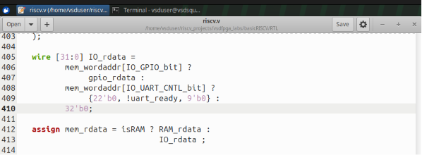

### Operation

When the processor reads the GPIO address:

```text
CPU Read Request
        │
        ▼
 GPIO Address Selected
        │
        ▼
 gpio_rdata
        │
        ▼
 IO_rdata
        │
        ▼
 mem_rdata
        │
        ▼
 CPU
```

This enables the processor to retrieve the last value stored inside the GPIO register.

---

## Integration Verification

After completing the modifications, multiple verification commands were executed to ensure successful integration.

### Verification Commands

```bash
grep -n "gpio.v" riscv.v
grep -n "IO_GPIO_bit" riscv.v
grep -n "gpio_we" riscv.v
grep -n "gpio GPIO" riscv.v
```

### Screenshot

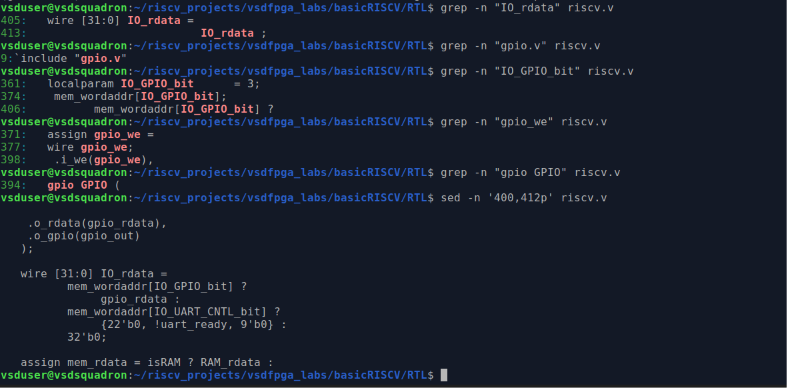

### Verified Items

✔ GPIO source file included

✔ GPIO address assigned

✔ GPIO write-enable logic present

✔ GPIO module instantiated

✔ GPIO signals declared

---

## Final Verification of Readback Path

The final GPIO readback path and memory interface were verified.

### Screenshot


### Verified Components

✔ GPIO read path

✔ IO_rdata integration

✔ mem_rdata connection

✔ Memory-mapped peripheral access

---

## Integration Architecture

```text
                       +----------------+
                       |   RISC-V CPU   |
                       +----------------+
                               |
                               |
                          Memory Bus
                               |
         ------------------------------------------------
         |                     |                        |
         |                     |                        |
        RAM                 I/O Space                Memory
                               |
        -------------------------------------------------
        |                  |                 |         |
        |                  |                 |         |
      LEDs            UART Data       UART Control   GPIO
                                                     |
                                                     |
                                              +-------------+
                                              |  gpio_reg   |
                                              +-------------+
                                                     |
                                                     |
                                                 gpio_out
```

---

## Step 3 Summary

The GPIO peripheral was successfully integrated into the RISC-V SoC.

### Completed Tasks

✔ Included GPIO source file

✔ Assigned memory-mapped GPIO address

✔ Added GPIO communication signals

✔ Implemented GPIO write-enable logic

✔ Instantiated GPIO module

✔ Connected GPIO readback path

✔ Verified successful integration

### Result

The GPIO peripheral is now fully connected to the SoC and can communicate with the processor through the existing memory-mapped I/O framework.

The next step is to validate the design through software-based testing and verify correct read/write operation of the GPIO register.

---

# Step 4: Developing and Testing GPIO Firmware

After integrating the GPIO peripheral into the RISC-V SoC, the next step was to develop firmware capable of interacting with the newly added memory-mapped GPIO device. The objective was to verify that the processor could successfully write data to the GPIO register and read the same value back through the memory-mapped interface.

---

## Understanding the Firmware Build Environment

Before writing the test application, the firmware build environment was examined to understand how software is compiled and converted into a format usable by the RISC-V processor.

The firmware Makefile was analyzed to identify:

- Target architecture (`RV32I`)
- ABI configuration (`ILP32`)
- Compiler and linker settings
- Firmware-to-HEX conversion flow
- Automatic generation of `firmware.hex` for the RTL design

### Screenshot: Firmware Makefile Analysis

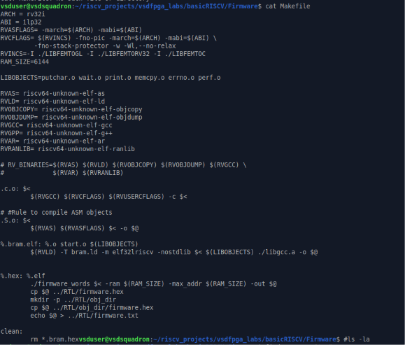

---

## Exploring Existing Firmware Sources

The firmware directory was inspected to understand the available software examples, support libraries, and utility files.

This exploration helped identify:

- Existing bare-metal applications
- FEMTO support libraries
- UART support functions
- Memory-mapped I/O framework

### Screenshot: Available Firmware Source Files

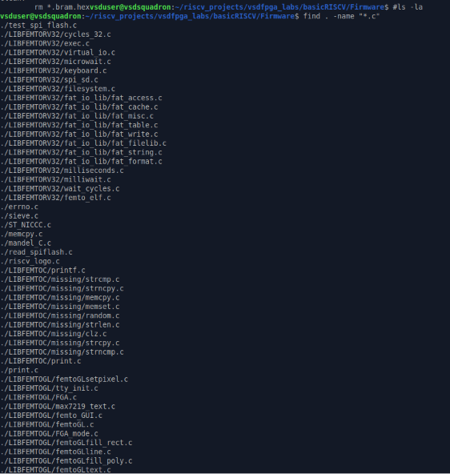

---

## Updating Memory-Mapped I/O Definitions

To make the GPIO peripheral accessible from software, a new GPIO address definition was added inside `io.h`.

### Existing Memory-Mapped Devices

| Peripheral | Address Offset |
|------------|----------------|
| LEDs | 4 |
| UART Data | 8 |
| UART Control | 16 |

### Added GPIO Mapping

```c
#define IO_GPIO 32
```

This address corresponds to the GPIO memory-mapped location introduced earlier in the RTL design using:

```verilog
localparam IO_GPIO_bit = 3;
```

Since:

```text
2^3 × 4 bytes = 32 bytes
```

the software and hardware address maps remain consistent.

### Screenshot: Updated io.h

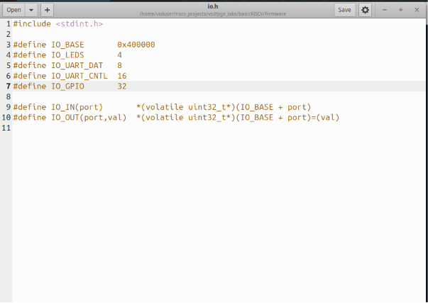

---

## Creating GPIO Test Application

A dedicated firmware program named:

```text
gpio_test.c
```

was created to verify GPIO functionality.

### Program Workflow

1. Initialize a test value.
2. Write the value to GPIO.
3. Read the value back from GPIO.
4. Compare the written and read values.
5. Print PASS or FAIL status through UART.

### GPIO Test Program

```c
#include <stdio.h>
#include <stdint.h>
#include "io.h"

int main() {

    uint32_t write_value = 123;

    printf("GPIO Test Started\n");

    IO_OUT(IO_GPIO, write_value);

    uint32_t read_value = IO_IN(IO_GPIO);

    printf("Written Value : %d\n", write_value);
    printf("Read Value    : %d\n", read_value);

    if(read_value == write_value) {
        printf("GPIO TEST PASSED\n");
    } else {
        printf("GPIO TEST FAILED\n");
    }

    while(1);

    return 0;
}
```

### Screenshot: GPIO Test Source Code

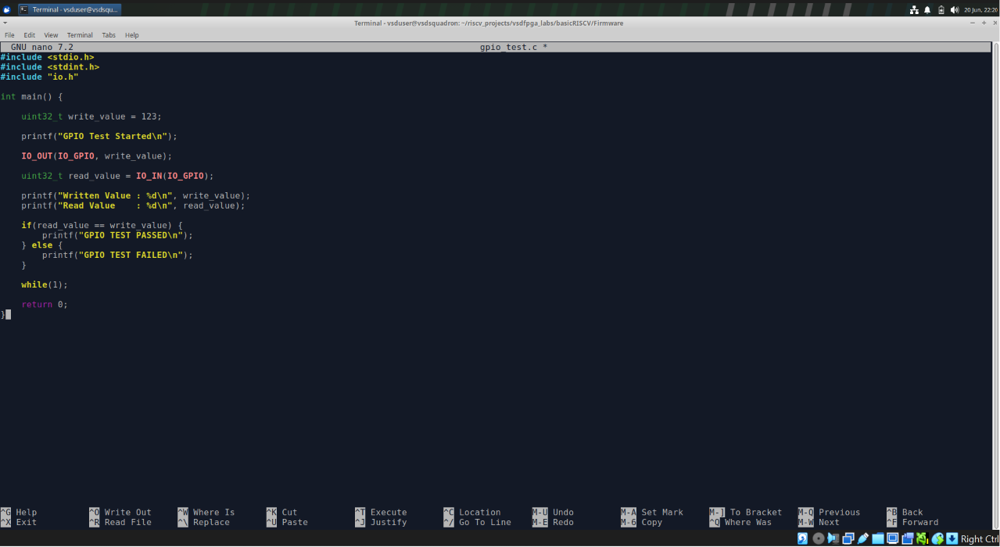

### Screenshot: Terminal Verification of gpio_test.c

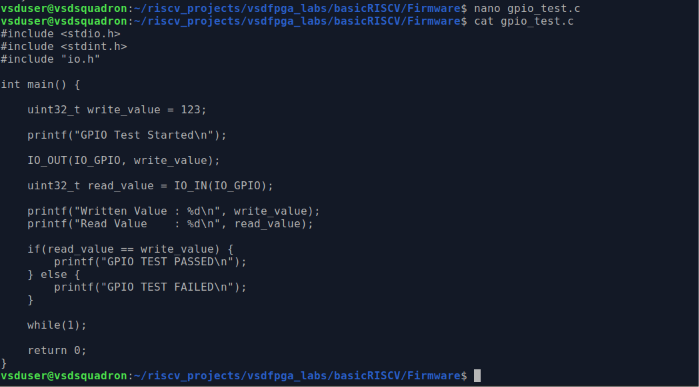

---

## Understanding Memory-Mapped GPIO Access

The firmware accesses peripherals through memory-mapped I/O macros defined in `io.h`.

### Writing Data to GPIO

```c
IO_OUT(IO_GPIO, write_value);
```

This macro expands to:

```c
*(volatile uint32_t*)(IO_BASE + IO_GPIO) = write_value;
```

The processor performs a memory write transaction to the GPIO register location.

---

### Reading Data from GPIO

```c
uint32_t read_value = IO_IN(IO_GPIO);
```

This macro expands to:

```c
*(volatile uint32_t*)(IO_BASE + IO_GPIO)
```

The processor performs a memory read transaction from the GPIO register.

---

### Verification Logic

```c
if(read_value == write_value)
```

The returned value is compared with the transmitted value to verify correct GPIO operation.

---

## Compiling the GPIO Firmware

The GPIO test application was compiled using the existing RV32I firmware build flow.

### Build Command

```bash
make gpio_test.bram.elf
```

The compilation process generated:

```text
gpio_test.o
gpio_test.bram.elf
```

where:

- `gpio_test.o` is the compiled object file.
- `gpio_test.bram.elf` is the linked executable for the RISC-V processor.

### Screenshot: Firmware Compilation

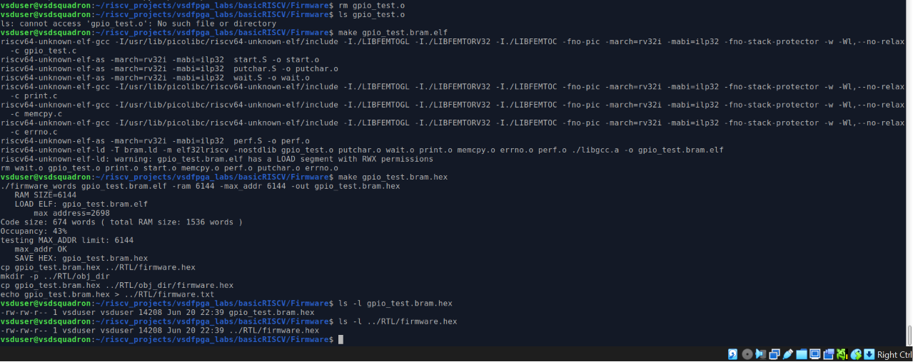

---

## Generating Firmware Memory Image

After successful compilation, the executable was converted into a memory initialization file that can be loaded into the processor's RAM.

### Command

```bash
make gpio_test.bram.hex
```

The build flow generated:

```text
gpio_test.bram.elf
        ↓
gpio_test.bram.hex
        ↓
firmware.hex
        ↓
RTL/firmware.hex
```

The generated `firmware.hex` file is automatically loaded into the memory block during synthesis.

### Screenshot: Firmware HEX Generation

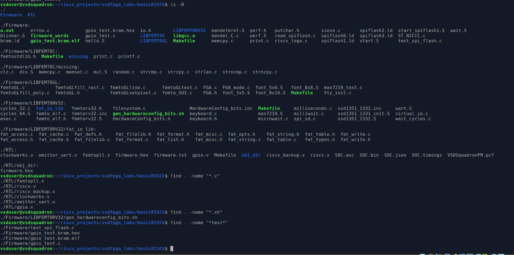

---

## Verifying Firmware Placement

The generated firmware image was verified to ensure successful placement inside the RTL directory.

Verification confirmed that:

```text
gpio_test.bram.hex
firmware.hex
```

were generated successfully.

### Screenshot: Firmware Verification


---

## FPGA Synthesis and Bitstream Generation

After completing both the hardware and software modifications, the entire SoC was rebuilt.

### RTL Build Flow

The RTL Makefile was analyzed to understand the FPGA implementation flow.

### Screenshot: RTL Build Makefile

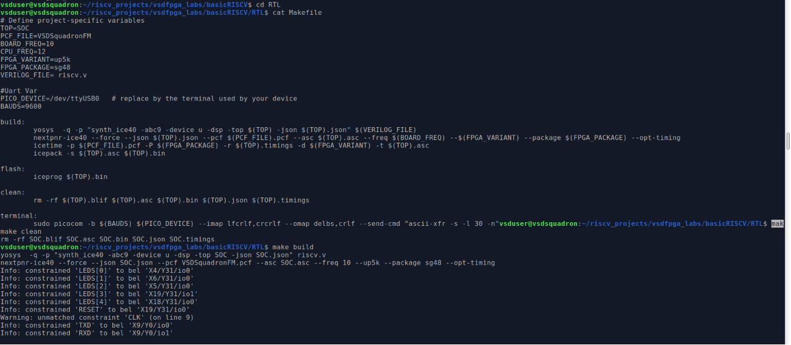

### Build Commands

```bash
cd RTL

make clean
make build
```

The FPGA flow executed the following stages:

```text
Yosys
   ↓
nextpnr-ice40
   ↓
icetime
   ↓
icepack
   ↓
SOC.bin
```

Generated files:

```text
SOC.json
SOC.asc
SOC.timings
SOC.bin
```

---

## Successful FPGA Build

The synthesis process completed successfully with:

```text
0 errors
```

and generated a valid FPGA bitstream.

Timing analysis reported:

```text
Max frequency for clock 'clk': 18.87 MHz
PASS at 12.00 MHz
```

This confirms that the GPIO integration did not violate the timing requirements of the original SoC design.

### Screenshot: Successful FPGA Build and Timing Report

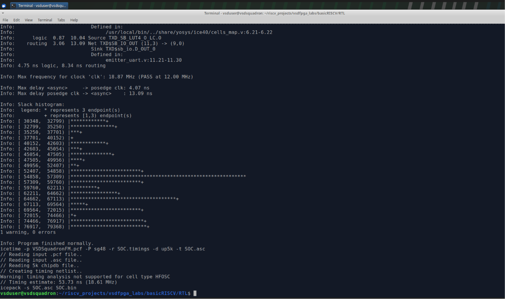

---

# Step 4 Outcome

## Hardware Achievements

- Successfully integrated GPIO peripheral into the RISC-V SoC.
- Implemented memory-mapped read and write access.
- Extended the I/O subsystem with a new GPIO address space.

## Software Achievements

- Created a dedicated GPIO test application.
- Implemented memory-mapped GPIO write and read operations.
- Verified correct software access methodology.

## FPGA Implementation Achievements

- Successfully generated firmware image.
- Successfully rebuilt the modified SoC.
- Achieved timing closure.
- Generated FPGA bitstream (`SOC.bin`) without errors.

---

## RTL Functional Verification of GPIO IP

After integrating the GPIO peripheral into the RISC-V SoC, the GPIO module was functionally verified using **Icarus Verilog** and a custom Verilog testbench (`tb_gpio.v`).

The objective of this simulation was to verify the functionality of the GPIO IP independently before deploying it as part of the complete SoC.

### Test Flow

The GPIO module was instantiated in a dedicated testbench, where the following sequence of operations was performed:

- Reset the GPIO module.
- Release the reset signal.
- Write the value **123** to the GPIO register.
- Disable the write enable signal.
- Read back the GPIO output and register data.
- Compare the read value with the written value.
- Display the simulation result on the terminal.

### Simulation Commands

```bash
iverilog -o gpio_sim tb_gpio.v gpio.v
vvp gpio_sim
```

### RTL Simulation Output

The terminal output confirms that:

- Reset was successfully applied.
- The value **123** was written into the GPIO register.
- The GPIO output correctly reflected the written value.
- The read-back data matched the stored value.
- The GPIO module passed functional verification.

<p align="center">
 

</p>

### Simulation Result

```
GPIO RTL SIMULATION

[0] Reset Asserted
[2000] Reset Released
[3000] Writing Value = 123
[5000] GPIO Output = 123
[5000] Read Data = 123

GPIO RTL TEST PASSED

Simulation Finished.
```

### Observation

The RTL simulation verifies the correct functionality of the standalone GPIO IP. The successful write and read-back operations demonstrate that the GPIO register logic, write enable control, and output interface operate as expected before deployment in the complete RISC-V SoC.

---

## Verification: GPIO Functional Simulation using Icarus Verilog and GTKWave

To further validate the functionality of the newly integrated GPIO peripheral, a standalone Verilog testbench was created and simulated using **Icarus Verilog (iverilog)**. The generated waveform was then analyzed using **GTKWave**.

This simulation verifies that:

- The GPIO register is properly reset.
- Data can be written into the GPIO register.
- The written value is correctly stored.
- The stored value can be read back through the GPIO read interface.

---

### Testbench Creation

A dedicated testbench file `tb_gpio.v` was created to provide clock, reset, write-enable, and write-data stimuli to the GPIO module.

The testbench performs the following sequence:

1. Assert reset (`i_rst = 1`).
2. Release reset after 20 ns.
3. Apply a write operation with value `123` (`0x7B`).
4. Deassert write enable.
5. Generate a waveform file (`gpio.vcd`) for analysis.

### Testbench Source

```verilog
`timescale 1ns/1ps

module tb_gpio;

reg i_clk;
reg i_rst;
reg i_we;
reg [31:0] i_wdata;

wire [31:0] o_rdata;
wire [31:0] o_gpio;

gpio dut (
    .i_clk(i_clk),
    .i_rst(i_rst),
    .i_we(i_we),
    .i_wdata(i_wdata),
    .o_rdata(o_rdata),
    .o_gpio(o_gpio)
);

always #5 i_clk = ~i_clk;

initial begin
    $dumpfile("gpio.vcd");
    $dumpvars(0, tb_gpio);

    i_clk = 0;
    i_rst = 1;
    i_we = 0;
    i_wdata = 0;

    #20;
    i_rst = 0;

    #10;
    i_wdata = 32'd123;
    i_we = 1;

    #10;
    i_we = 0;

    #50;
    $finish;
end

endmodule
```

---

### Simulation Compilation and Execution

The testbench and GPIO module were compiled and executed using Icarus Verilog.

```bash
iverilog -o gpio_sim tb_gpio.v gpio.v
vvp gpio_sim
```

The simulation generated the waveform database file:

```text
gpio.vcd
```

which was opened using GTKWave.

---

### Testbench Creation and Configuration

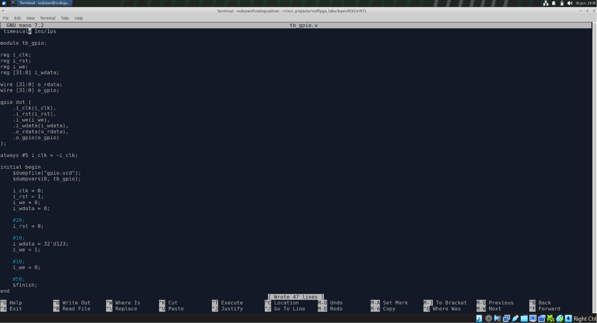

**Figure:** Creation of the GPIO testbench (`tb_gpio.v`) used to stimulate the GPIO module and generate simulation waveforms.

---

### Simulation Compilation and Execution

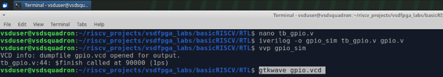

**Figure:** Successful compilation and execution of the GPIO simulation using Icarus Verilog. The waveform file `gpio.vcd` was generated successfully.

---

### GTKWave Simulation Result

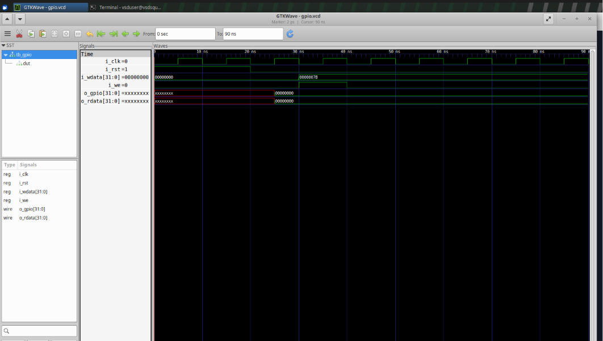

**Figure:** GPIO simulation waveform displayed in GTKWave.

---

### Waveform Analysis

The waveform demonstrates the following sequence:

#### Reset Phase (0 ns – 20 ns)

- `i_rst` remains high.
- GPIO register remains in reset state.

#### Write Operation (~30 ns)

- `i_we` is asserted.
- `i_wdata` is loaded with:

```text
0x0000007B
```

which corresponds to:

```text
123 (decimal)
```

#### GPIO Register Update

After the next positive clock edge:

```text
o_gpio = 0x0000007B
```

This confirms that the GPIO register successfully captures the written data.

#### Read Verification

Simultaneously:

```text
o_rdata = 0x0000007B
```

This confirms that the stored GPIO value is correctly returned through the read interface.

---

### Verification Summary

| Signal | Observed Value |
|----------|----------|
| Write Data (`i_wdata`) | 123 (`0x7B`) |
| GPIO Output (`o_gpio`) | 123 (`0x7B`) |
| Read Data (`o_rdata`) | 123 (`0x7B`) |

---

The simulation successfully verified the functionality of the GPIO peripheral.

The waveform confirms that:

- Data written to the GPIO register is stored correctly.
- The GPIO output reflects the written value.
- Read operations return the expected data.
- The GPIO peripheral behaves as intended before deployment on FPGA hardware.

This provides an additional level of validation beyond synthesis and bitstream generation and confirms the correctness of the GPIO design at the RTL level.

---

## Conclusion

In this step, a complete hardware-software co-design workflow was implemented. A custom GPIO peripheral was accessed through memory-mapped I/O using firmware running on the RISC-V processor. The firmware was compiled into a memory image, integrated into the SoC build flow, and successfully synthesized into an FPGA bitstream. The successful generation of `SOC.bin` and the timing report confirmed the correct integration of the GPIO peripheral into the RISC-V system.

