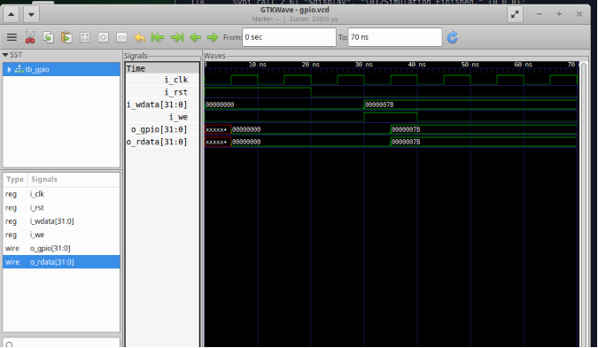

# Task 4 - Correct GTKWave Output

## Overview

During the original Task 4 submission, only one GTKWave screenshot was included in the documentation.

This folder provides the second GTKWave waveform corresponding to the completed Task 4 implementation.

No RTL source code, testbench, or implementation has been modified. This update is provided solely to include the correct simulation waveform.

---

## Second GTKWave Waveform

---

## Note

This folder serves as a supplementary record for the correct GTKWave output associated with Task 4 after the submission deadline.
