# Task 5: Design a Multi-Register GPIO IP with Software Control

## Step 1: Study and Planning

---

## Objective

The objective of Task-3 is to extend the simple single-register GPIO IP developed in Task-2 into a realistic multi-register, software-controlled GPIO peripheral similar to those used in modern System-on-Chip (SoC) architectures.

This task focuses on:

- Designing a proper register map
- Handling multiple registers inside a single IP
- Understanding memory-mapped I/O
- Establishing software-to-hardware communication through multiple registers

Unlike Task-2, where only a single GPIO register was available, this task introduces dedicated registers for output data, direction control, and GPIO readback.

---

## Review of Task-2 GPIO IP

Before starting the implementation, the existing GPIO IP developed in Task-2 was carefully reviewed.

The previous GPIO IP provided:

- A single GPIO register
- Write operation to GPIO outputs
- Readback of the stored value
- Basic memory-mapped interface

Although functional, the previous implementation lacked separate registers for configuring GPIO direction and reading actual GPIO pin status. Therefore, the GPIO peripheral required architectural improvements before moving towards a more realistic SoC peripheral.

---

## IP Specification

The Task-3 GPIO IP consists of three memory-mapped registers.

| Offset | Register | Description |
|---------|----------|-------------|
| 0x00 | GPIO_DATA | Stores GPIO output data |
| 0x04 | GPIO_DIR | Configures GPIO direction (1 = Output, 0 = Input) |
| 0x08 | GPIO_READ | Returns current GPIO pin state |

The GPIO base address remains the same as in Task-2.

---

## Planning the Design

Before modifying the RTL, the complete architecture of the GPIO peripheral was planned.

The following enhancements were identified.

### 1. Multiple Register Architecture

Instead of using only one register, the GPIO peripheral will now contain three independent registers.

- GPIO_DATA
- GPIO_DIR
- GPIO_READ

Each register performs a dedicated function and can be independently accessed by software.

---

### 2. Address Offset Decoding

Since multiple registers share the same GPIO base address, address decoding must be implemented inside the GPIO IP.

The address offsets will be decoded as follows.

| Address Offset | Selected Register |
|----------------|------------------|
| 0x00 | GPIO_DATA |
| 0x04 | GPIO_DIR |
| 0x08 | GPIO_READ |

This enables the processor to access different GPIO registers using different offsets from the same base address.

---

### 3. Internal Signals Required

The GPIO peripheral requires the following internal signals.

| Signal | Purpose |
|---------|----------|
| gpio_data | Stores GPIO output values |
| gpio_dir | Stores GPIO direction bits |
| i_gpio_in | Receives external GPIO input values |
| o_gpio | Drives external GPIO outputs |
| o_rdata | Returns data to the processor during read operations |

---

### 4. Expected Read Behaviour

The GPIO_READ register should return different values depending on the GPIO direction.

- If a GPIO pin is configured as an output, GPIO_READ should return the driven output value.
- If a GPIO pin is configured as an input, GPIO_READ should return the external input value.

This behavior closely resembles the GPIO peripherals used in real embedded processors and SoCs.

---

## Planned Architecture

```text
                 CPU
                  │
                  │
        Memory-Mapped Bus
                  │
           Address Decoder
                  │
      ┌───────────┼───────────┐
      │           │           │
 GPIO_DATA    GPIO_DIR    GPIO_READ
      │           │           │
      └───────────┼───────────┘
                  │
             GPIO Peripheral
                  │
             External GPIO Pins
```

---

## Step-1 Workflow

```text
Review Task-2 GPIO
        │
        ▼
Study Task-3 Specification
        │
        ▼
Identify Additional Registers
        │
        ▼
Plan Address Offset Decoding
        │
        ▼
Define Internal Signals
        │
        ▼
Prepare for RTL Implementation
```

---

## Observations

- Task-2 GPIO implementation uses only a single register.
- A realistic GPIO peripheral requires separate registers for data, direction, and readback.
- Address offset decoding allows multiple registers to be accessed through a single peripheral base address.
- Proper planning before RTL implementation simplifies integration with the processor and software.

---

## Conclusion

In Step-1, the existing GPIO peripheral from Task-2 was analyzed and the required architectural changes were planned before beginning RTL implementation.

The complete register map was defined, internal signals were identified, and the address decoding strategy was planned. This preparation provides a structured foundation for implementing the multi-register GPIO IP in the next step.

No RTL modifications were performed during this stage, as Step-1 focuses entirely on planning and design analysis.

---

# Screenshots

## Screenshot 1: Task-3 Specification (Objective and Register Map)

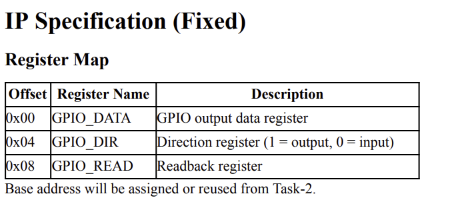

---

## Screenshot 3: Project Directory Structure

```bash
tree
```

Output:

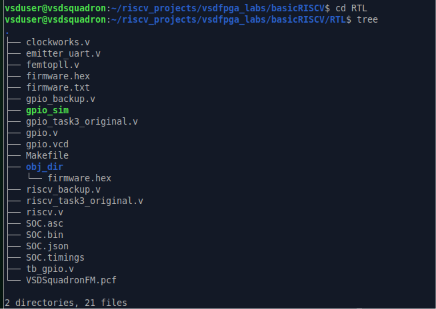

---


# Step 2: Implement Multi-Register GPIO RTL

---

## Objective

The objective of this step is to implement a multi-register GPIO IP that supports software-controlled GPIO operations through memory-mapped registers. The GPIO module was extended to include dedicated registers for GPIO output data, GPIO direction configuration, and GPIO readback, making it similar to GPIO peripherals used in real embedded processors and SoCs.

---

## Complete GPIO RTL Implementation

The first step was to implement the complete GPIO module. The GPIO IP communicates with the processor using a memory-mapped interface consisting of clock, reset, write enable, register address, write data, read data, GPIO input pins, and GPIO output pins.

The module contains two internal registers:

- **gpio_data** – Stores the output values written by the processor.
- **gpio_dir** – Stores the direction configuration for each GPIO pin.

The GPIO output pins are continuously driven using the contents of the `gpio_data` register.

### Screenshot: Complete GPIO RTL

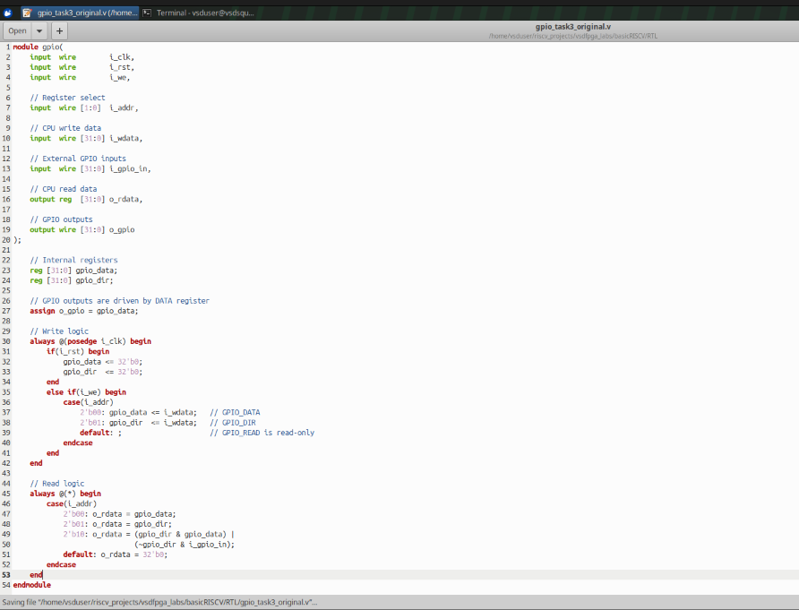

---

## Internal Register Implementation

Two 32-bit internal registers were created inside the GPIO module.

```verilog
reg [31:0] gpio_data;
reg [31:0] gpio_dir;
```

The purpose of these registers is:

| Register | Description |
|-----------|-------------|
| **gpio_data** | Stores GPIO output values written by software. |
| **gpio_dir** | Stores GPIO direction configuration. A value of `1` configures the corresponding GPIO pin as an output, while `0` configures it as an input. |

The GPIO outputs are directly connected to the `gpio_data` register.

```verilog
assign o_gpio = gpio_data;
```

---

## Synchronous Write Logic

The GPIO registers are updated using synchronous logic triggered on the positive edge of the clock.

Whenever the write enable signal (`i_we`) becomes active, the value of `i_addr` determines which register should be updated.

The implemented write operations are:

| Address | Register Updated |
|----------|-----------------|
| `2'b00` | GPIO_DATA |
| `2'b01` | GPIO_DIR |

During reset (`i_rst`), both registers are cleared to zero.

This ensures that the GPIO peripheral always starts from a known state after reset.

### Screenshot: Internal Registers and Write Logic

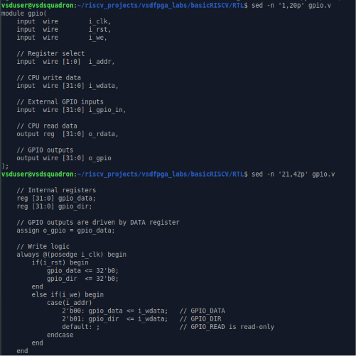

---

## Register Address Mapping

The GPIO peripheral implements three memory-mapped registers.

| Address | Register | Purpose |
|----------|----------|----------|
| **2'b00** | GPIO_DATA | Stores GPIO output values |
| **2'b01** | GPIO_DIR | Stores GPIO direction configuration |
| **2'b10** | GPIO_READ | Returns the current GPIO state |

The processor selects the required register by placing the corresponding value on the `i_addr` bus.

---

## Read Logic

The GPIO read operation is implemented using combinational logic.

Whenever the processor performs a read operation, the selected register is returned through `o_rdata`.

The implemented read behaviour is:

- Reading address `00` returns the contents of `GPIO_DATA`.
- Reading address `01` returns the contents of `GPIO_DIR`.
- Reading address `10` returns the GPIO_READ value.

GPIO_READ is generated using the following logic:

```verilog
(gpio_dir & gpio_data) |
(~gpio_dir & i_gpio_in)
```

This expression performs the following operation:

- If a GPIO pin is configured as an **output**, the stored output value is returned.
- If a GPIO pin is configured as an **input**, the corresponding external GPIO input value is returned.

This behaviour closely resembles the operation of GPIO peripherals found in commercial microcontrollers and embedded processors.

### Screenshot: Read Logic

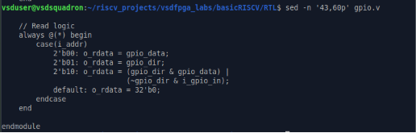

---

## Features Implemented

The updated GPIO peripheral now supports:

- Multi-register GPIO architecture
- Dedicated GPIO output register
- Dedicated GPIO direction register
- GPIO readback functionality
- Memory-mapped register interface
- Address-based register selection
- Synchronous write operations
- Combinational read operations
- Software-controlled GPIO functionality

---

## Step-2 Summary

In this step, the GPIO peripheral was successfully upgraded from a basic GPIO interface into a software-controlled multi-register IP.

Separate registers were implemented for GPIO output values and GPIO direction configuration. Address decoding was introduced to access different registers through the same peripheral interface, while the read logic was designed to return either the GPIO output value or the external input value depending on the configured GPIO direction.

This implementation provides a clean and scalable GPIO architecture that is ready to be integrated into the RISC-V SoC in the next step.

---

# Step 3: Integrate the GPIO IP into the RISC-V SoC

---

## Objective

After implementing the multi-register GPIO IP in the previous step, the next objective is to integrate the peripheral into the RISC-V System-on-Chip (SoC). The GPIO module must communicate with the processor using the existing memory-mapped I/O interface so that software running on the RISC-V core can configure GPIO direction, write output values, and read back GPIO states.

Unlike designing the GPIO module itself, this step focuses on connecting the peripheral with the processor while preserving the existing SoC architecture. The integration flow remains consistent with Task-2, as specified in the task document.

---

# GPIO Interface Signal Generation

Before connecting the GPIO peripheral, several interface signals were declared inside `riscv.v`. These signals form the communication bridge between the CPU and the GPIO IP.

```verilog
wire gpio_we;
wire [1:0] gpio_addr;
wire [31:0] gpio_rdata;
wire [31:0] gpio_out;
```

Each signal has a dedicated purpose:

| Signal | Description |
|---------|-------------|
| `gpio_we` | Enables writing into GPIO registers |
| `gpio_addr` | Selects one of the GPIO registers |
| `gpio_rdata` | Carries data returned by the GPIO peripheral |
| `gpio_out` | Carries GPIO output values |

The write enable signal is generated only when the processor performs a write operation to the GPIO address space.

```verilog
assign gpio_we =
    isIO &
    mem_wstrb &
    mem_wordaddr[IO_GPIO_bit];
```

Similarly, the register address is obtained from the processor address bus.

```verilog
assign gpio_addr = mem_addr[3:2];
```

This allows the processor to access different GPIO registers using address offsets.

### Screenshot: GPIO Interface Signal Generation

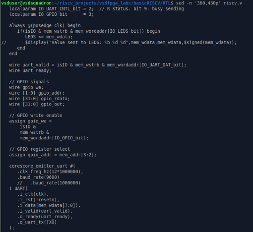

---

# GPIO Module Instantiation

After generating the required interface signals, the GPIO peripheral was instantiated inside the SoC.

```verilog
gpio GPIO (
    .i_clk(clk),
    .i_rst(!resetn),
    .i_we(gpio_we),
    .i_addr(gpio_addr),
    .i_wdata(mem_wdata),
    .i_gpio_in(32'b0),
    .o_rdata(gpio_rdata),
    .o_gpio(gpio_out)
);
```

Each processor signal is connected directly to the corresponding GPIO interface.

The GPIO input pins are temporarily connected to `32'b0` because no external GPIO hardware is used during simulation in this task.

This integration enables the processor to access the GPIO peripheral exactly like any other memory-mapped device inside the SoC.

### Screenshot: GPIO Module Instantiation

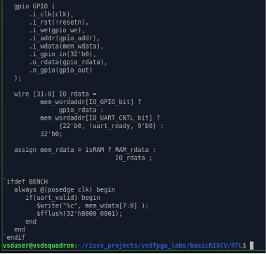

---

# Memory-Mapped Read Integration

Once the GPIO peripheral is connected, its read data must be integrated into the processor's memory read path.

This is achieved using the existing memory read multiplexer.

```verilog
wire [31:0] IO_rdata =
    mem_wordaddr[IO_GPIO_bit] ?
        gpio_rdata :
    mem_wordaddr[IO_UART_CNTL_bit] ?
        {22'b0, !uart_ready, 9'b0} :
        32'b0;
```

Whenever the processor accesses the GPIO memory region, the GPIO read data is selected and forwarded back to the CPU.

This allows software to read:

- GPIO_DATA
- GPIO_DIR
- GPIO_READ

through standard memory read instructions without requiring any dedicated hardware interface.

The GPIO peripheral therefore becomes a fully memory-mapped IP inside the RISC-V processor.

### Screenshot: GPIO Read Integration

*(Included in the screenshot above.)*

---

# Final SoC Integration

After integrating the GPIO peripheral, the remaining SoC architecture remains unchanged.

The clock generation, reset circuitry, processor core, UART, and other system components continue to operate exactly as before. The GPIO peripheral simply becomes another memory-mapped device connected to the processor bus.

This demonstrates that the GPIO IP has been integrated without affecting the existing SoC structure.

### Screenshot: Final SoC Structure

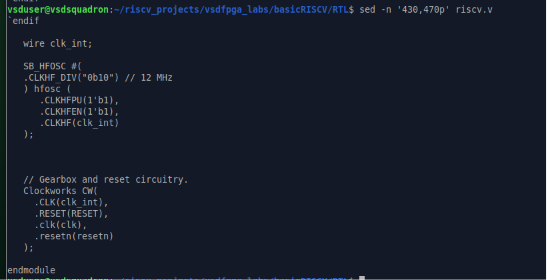

---

# RTL Compilation and Synthesis

After completing the integration, the entire RTL design was rebuilt to verify that the updated SoC synthesizes correctly.

The project was compiled using the provided build system.

```bash
make clean
make
```

The synthesis flow completed successfully and generated:

- Synthesized RTL
- Place-and-route output
- Timing report
- FPGA bitstream (`SOC.bin`)

The timing analysis reports a maximum operating frequency of approximately **18.65 MHz**, which comfortably satisfies the required **12 MHz** operating frequency.

This confirms that the GPIO integration does not introduce synthesis or timing issues.

### Screenshot: Successful RTL Build

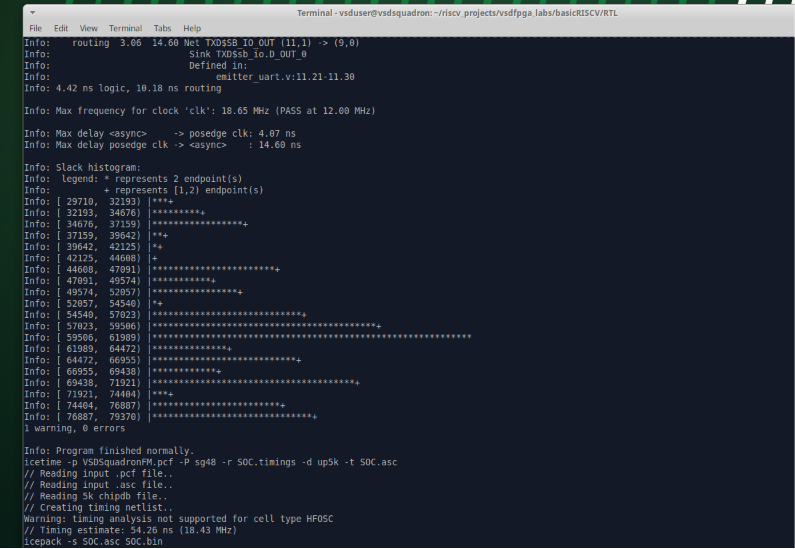


---

# Step-3 Summary

In this step, the multi-register GPIO peripheral was successfully integrated into the RISC-V SoC.

The required interface signals were generated, the GPIO module was connected to the processor, and the memory-mapped read path was updated so that software can access all GPIO registers through standard load and store operations.

Finally, the complete SoC was synthesized successfully, confirming that the GPIO integration introduced no synthesis or timing violations. An additional RTL syntax verification was attempted using Icarus Verilog, where the compilation reached the FPGA primitive stage before stopping due to missing simulation stub models, which is expected for this repository.

The SoC is now fully prepared for software validation using a C test program in the next step.

---

# Step 4: Firmware Development, RTL Simulation and FPGA Programming

## Objective

After successfully integrating the GPIO peripheral into the RISC-V SoC, the next objective was to verify its functionality using both software and hardware.

The verification process involved:

- Developing a dedicated firmware application to test all GPIO registers.
- Defining the GPIO register map.
- Compiling the firmware into a BRAM initialization file.
- Rebuilding the SoC with the updated firmware.
- Verifying FPGA detection and programming.
- Creating an RTL testbench for functional simulation.
- Simulating the GPIO module using Icarus Verilog.
- Analysing the generated waveform using GTKWave.

---

# 4.1 Firmware Development

A dedicated firmware program (`gpio_test.c`) was developed to validate all three GPIO registers.

The program performs the following sequence:

- Configures all GPIO pins as outputs by writing to the GPIO Direction Register.
- Writes a known value (123) into the GPIO Data Register.
- Reads back the Direction Register.
- Reads back the Data Register.
- Reads the GPIO Read Register.
- Compares the returned values with the expected values.
- Prints PASS/FAIL messages for every individual test.
- Displays the final GPIO test result.

### Screenshot

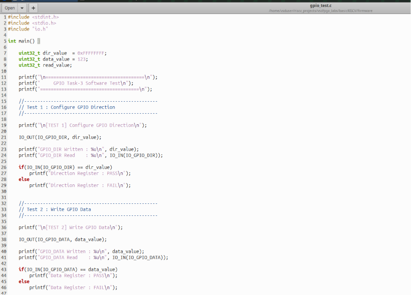
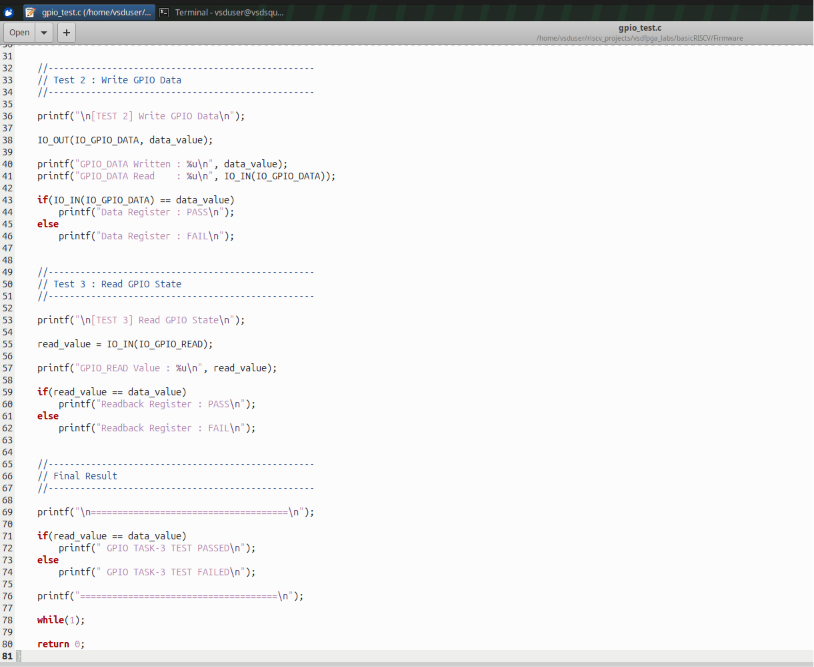

---

The complete source code is shown below.

```c
#include <stdint.h>
#include <stdio.h>
#include "io.h"

int main()
{
    uint32_t dir_value = 0xFFFFFFFF;
    uint32_t data_value = 123;
    uint32_t read_value;

    printf("\n");
    printf("===================================\n");
    printf("     GPIO Task-3 Software Test\n");
    printf("===================================\n");

    //--------------------------------------------------
    // Test 1
    //--------------------------------------------------

    printf("\n[TEST 1] Configure GPIO Direction\n");

    IO_OUT(IO_GPIO_DIR, dir_value);

    printf("GPIO_DIR Written : %u\n", dir_value);
    printf("GPIO_DIR Read    : %u\n", IO_IN(IO_GPIO_DIR));

    if(IO_IN(IO_GPIO_DIR) == dir_value)
        printf("Direction Register : PASS\n");
    else
        printf("Direction Register : FAIL\n");

    //--------------------------------------------------
    // Test 2
    //--------------------------------------------------

    printf("\n[TEST 2] Write GPIO Data\n");

    IO_OUT(IO_GPIO_DATA, data_value);

    printf("GPIO_DATA Written : %u\n", data_value);
    printf("GPIO_DATA Read    : %u\n", IO_IN(IO_GPIO_DATA));

    if(IO_IN(IO_GPIO_DATA) == data_value)
        printf("Data Register : PASS\n");
    else
        printf("Data Register : FAIL\n");

    //--------------------------------------------------
    // Test 3
    //--------------------------------------------------

    printf("\n[TEST 3] Read GPIO State\n");

    read_value = IO_IN(IO_GPIO_READ);

    printf("GPIO_READ Value : %u\n", read_value);

    if(read_value == data_value)
        printf("Readback Register : PASS\n");
    else
        printf("Readback Register : FAIL\n");

    //--------------------------------------------------

    printf("===================================\n");

    if(read_value == data_value)
        printf(" GPIO TASK-3 TEST PASSED\n");
    else
        printf(" GPIO TASK-3 TEST FAILED\n");

    printf("===================================\n");

    while(1);

    return 0;
}
```

---

# 4.2 GPIO Register Definitions

The firmware communicates with the GPIO peripheral through memory-mapped I/O registers.

The register addresses were defined inside **io.h**.

| Register | Address |
|-----------|----------|
| GPIO_DATA | 0x20 |
| GPIO_DIR | 0x24 |
| GPIO_READ | 0x28 |

The macros `IO_IN()` and `IO_OUT()` are used to access these registers through volatile memory operations.

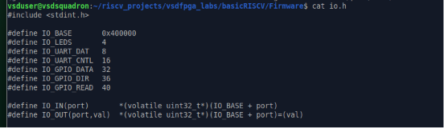

---

# 4.3 Firmware Compilation

The firmware was compiled using the RISC-V GNU toolchain.

Compilation command:

```bash
make gpio_test.bram.hex
```

During compilation:

- Source files were compiled into object files.
- Object files were linked together.
- An ELF executable was generated.
- The ELF image was converted into a BRAM initialization HEX file.
- The generated HEX file was automatically copied into the RTL directory.

The final firmware image generated was:

```
gpio_test.bram.hex
```

### Screenshot

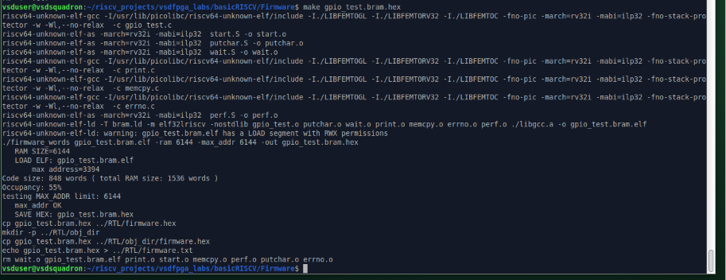

---

# 4.4 Updating the RTL Firmware

After successful compilation, the generated firmware was copied into the RTL project.

The file

```
firmware.txt
```

was updated to point towards

```
gpio_test.bram.hex
```

This ensures that during synthesis the RISC-V processor boots using the newly generated firmware.

The generated firmware image was also verified inside the RTL directory.

### Screenshot


### Screenshot

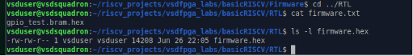

---

# 4.5 Rebuilding the SoC

Once the firmware was updated, the entire SoC was rebuilt.

Command used:

```bash
make
```

This process performed:

- Logic synthesis using Yosys
- Place-and-route using nextpnr
- Timing analysis using icetime
- Bitstream generation using icepack

A new FPGA bitstream (`SOC.bin`) was generated containing the updated firmware.

### Screenshot

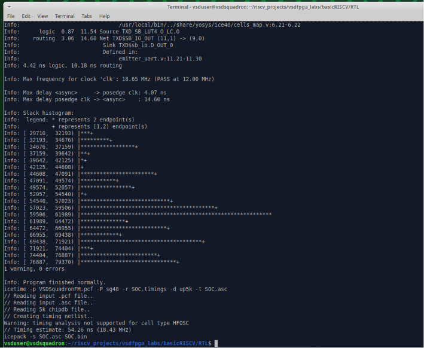

---

# 4.6 FPGA Detection

Before programming the FPGA, the USB interface was verified.

The following commands were used:

```bash
lsusb
```

```bash
ls /dev/ttyUSB* /dev/ttyACM*
```

The FT232H USB-UART interface of the VSDSquadron FPGA Mini board was successfully detected.

The Linux system also created the serial device

```
/dev/ttyUSB0
```

confirming successful USB communication.

### Screenshot

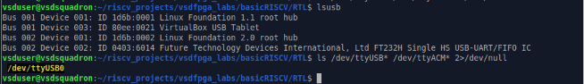

---

# 4.7 FPGA Programming

The generated bitstream was programmed into the FPGA using:

```bash
sudo iceprog SOC.bin
```

Programming completed successfully.

Important observations:

- Flash erase completed.
- Bitstream programming completed.
- Read-back verification passed.
- Device verification reported **VERIFY OK**.

This confirmed that the FPGA was successfully programmed with the updated SoC containing the GPIO firmware.

### Screenshot

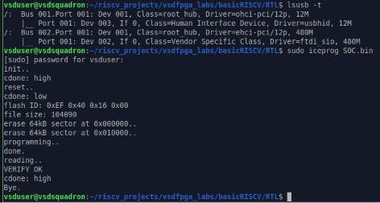
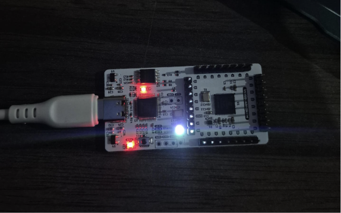

---

# 4.8 RTL Functional Verification

Although hardware programming verifies successful FPGA configuration, RTL simulation provides functional verification of the GPIO module before hardware execution.

A dedicated Verilog testbench (`tb_gpio.v`) was developed.

The testbench performs:

- Reset sequence
- GPIO_DATA write
- GPIO_DIR write
- GPIO_DATA read
- GPIO_DIR read
- GPIO_READ read
- PASS/FAIL verification
- Waveform dumping

### Screenshot of testbench

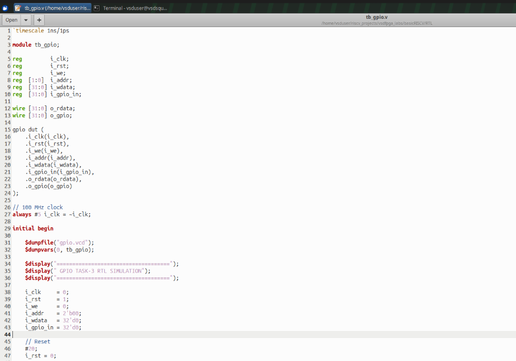
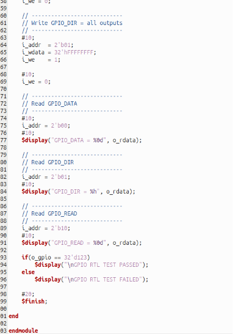


---

# 4.9 RTL Compilation

The GPIO module and testbench were compiled using Icarus Verilog.

Compilation command:

```bash
iverilog -g2012 -o gpio_sim tb_gpio.v gpio.v
```

The compiler successfully generated the simulation executable

```
gpio_sim
```

The simulation was executed using

```bash
vvp gpio_sim
```

Simulation output:

```
GPIO_DATA = 123
GPIO_DIR = ffffffff
GPIO_READ = 123

GPIO RTL TEST PASSED
```

The simulation also generated the waveform file

```
gpio.vcd
```

### Screenshot

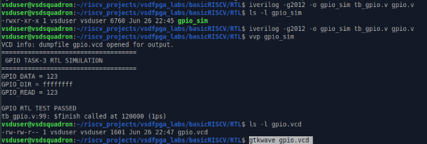

---

# 4.10 GTKWave Analysis

The generated VCD file was opened using GTKWave.

```bash
gtkwave gpio.vcd
```

The waveform confirms:

- Reset operation
- Clock generation
- GPIO_DATA write
- GPIO_DIR write
- GPIO_READ operation
- Correct GPIO output generation
- Correct register readback

The waveform clearly demonstrates that the GPIO peripheral behaves exactly as intended.


### Waveform Observations

- During reset, all GPIO registers initialize to zero.
- The DATA register captures the value **123** after the write operation.
- The DIR register stores **0xFFFFFFFF**, configuring all GPIO pins as outputs.
- The READ register correctly returns the output data because every pin is configured as an output.
- The simulation ends with **GPIO RTL TEST PASSED**, confirming correct functional behaviour.

### Screenshot

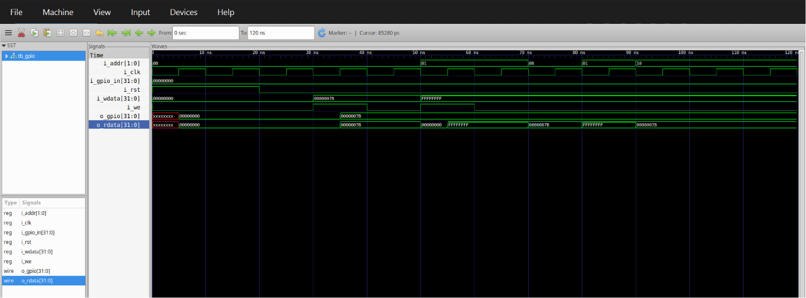

---

# Conclusion

The GPIO peripheral was successfully verified through both firmware generation and RTL simulation.

The following milestones were successfully completed:

- GPIO firmware developed.
- GPIO register map defined.
- Firmware compiled successfully.
- Firmware integrated into the SoC.
- FPGA bitstream generated.
- FPGA successfully programmed.
- RTL simulation completed.
- Waveforms verified using GTKWave.
- All GPIO read/write operations produced the expected behaviour.

These results confirm that the GPIO peripheral is correctly integrated with the RISC-V SoC and operates as intended under both software and RTL simulation.
