# PWM IP Development for RISC-V SoC

> Core Contributor Task – Real Peripheral IP Development

---

# Table of Contents

- Introduction
- Project Objective
- What is PWM?
- PWM Working Principle
- Design Features
- PWM Architecture
- Register Map
- RTL Module Overview

---

# Introduction

Pulse Width Modulation (PWM) is one of the most widely used digital techniques in embedded systems for controlling the average power delivered to electronic devices. Rather than varying the supply voltage directly, PWM rapidly switches the output between HIGH and LOW states while maintaining a constant frequency. By changing the percentage of time the output remains HIGH within one complete period, the effective output power can be accurately controlled.

In this project, a custom **PWM Intellectual Property (IP)** core was designed in **Verilog HDL** and integrated into an existing **RISC-V based System-on-Chip (SoC)**. The peripheral is implemented as a **memory-mapped hardware module**, allowing the processor to configure its operating parameters through software.

The complete design includes RTL development, SoC integration, software validation, functional simulation, and FPGA implementation on the **VSDSquadron FM (Lattice iCE40UP5K)** development board.

---

# Project Objective

The primary objective of this task is to design and integrate a reusable PWM peripheral that can be controlled by software executing on the RISC-V processor.

The implementation consists of the following stages:

- Design the PWM peripheral in Verilog HDL.
- Implement configurable control and status registers.
- Integrate the PWM module into the existing SoC.
- Access the peripheral using memory-mapped I/O.
- Develop firmware to configure the PWM registers.
- Verify functionality using simulation.
- Validate the design on FPGA hardware.

The final system demonstrates interaction between software and hardware through memory-mapped register access.

---

# What is Pulse Width Modulation (PWM)?

Pulse Width Modulation (PWM) is a digital modulation technique in which the output signal rapidly alternates between HIGH and LOW states while maintaining a fixed switching frequency.

Instead of changing the output voltage directly, the average voltage is controlled by adjusting the proportion of time the signal remains HIGH.

This proportion is called the **Duty Cycle**.

The duty cycle is mathematically expressed as:

\[
Duty\ Cycle = \frac{High\ Time}{Total\ Period}\times100\%
\]

---

## Duty Cycle Illustration

### 25% Duty Cycle

```
████____________
```

### 50% Duty Cycle

```
████████________
```

### 75% Duty Cycle

```
████████████____
```

As the duty cycle increases, the average output voltage also increases.

---

# Applications of PWM

PWM is one of the most important peripherals available in modern microcontrollers and processors.

Typical applications include:

- LED brightness control
- DC motor speed control
- Servo motor positioning
- Battery charging systems
- Switching power supplies
- Audio signal generation
- Embedded control systems
- Power electronics

---

# PWM IP Features

The developed PWM IP provides the following functionality:

- Single-channel PWM generation
- Software programmable duty cycle
- Software programmable period
- Memory-mapped register interface
- Enable and Disable control
- Output polarity inversion
- Status register for monitoring
- Easy integration with RISC-V SoC

The modular design allows the peripheral to be reused in future FPGA or ASIC-based systems.

---

# PWM System Architecture

The overall architecture of the developed system is shown below.

```
                +----------------------+
                |   RISC-V Processor   |
                +----------+-----------+
                           |
                           |
                    Memory Mapped Bus
                           |
      -----------------------------------------
      |                                       |
      |                                       |
+-------------+                     +----------------+
| GPIO Module |                     |   PWM Module   |
+-------------+                     +----------------+
                                          |
                                          |
                                    PWM Output Signal
                                          |
                                          |
                                     FPGA RGB LED
```

The processor communicates with the PWM peripheral through memory-mapped registers. Firmware running on the processor writes configuration values into the PWM registers, which are then used by the hardware logic to generate the PWM waveform.

---

# PWM Register Map

The PWM peripheral occupies a dedicated address region within the SoC I/O space.

| Register | Offset | Access | Description |
|-----------|--------|--------|-------------|
| CTRL | 0x00 | Read / Write | Controls PWM enable and output polarity |
| PERIOD | 0x04 | Read / Write | Stores PWM period |
| DUTY | 0x08 | Read / Write | Stores PWM duty cycle |
| STATUS | 0x0C | Read Only | Indicates running status and counter value |

---

## CTRL Register

The CTRL register controls the overall operation of the PWM peripheral.

| Bit | Function |
|-----|----------|
| Bit 0 | PWM Enable |
| Bit 1 | Output Polarity |

When the enable bit is set, the PWM counter begins counting and waveform generation starts.

The polarity bit allows the generated waveform to be inverted whenever required.

---

## PERIOD Register

The PERIOD register specifies the total number of clock cycles corresponding to one PWM period.

Internally, the counter repeatedly counts from:

```
0
↓

1
↓

2
↓

...
↓

PERIOD - 1
↓

0
```

Increasing the period decreases the PWM frequency, while decreasing the period increases the frequency.

---

## DUTY Register

The DUTY register determines the ON time of the PWM output.

The PWM output remains HIGH whenever

```
Counter < Duty
```

and remains LOW otherwise.

Therefore,

Higher DUTY value

↓

Longer HIGH duration

↓

Higher average output voltage

---

## STATUS Register

The STATUS register provides information regarding the current operating condition of the peripheral.

It contains:

- PWM Running Status
- Current Counter Value

Software can periodically read this register to verify correct hardware operation during testing.

---

# RTL Module Overview

The PWM IP has been designed as an independent Verilog module with a clean and reusable interface.

The module consists of:

- Register Interface
- Register Write Logic
- PWM Counter
- PWM Waveform Generator
- Status Register
- Read Logic

The processor communicates with the module using a simple memory-mapped interface consisting of write enable, register select, write data, and read data signals.

---

# RTL Module Interface

**Figure 1** shows the module declaration and interface of the PWM IP.

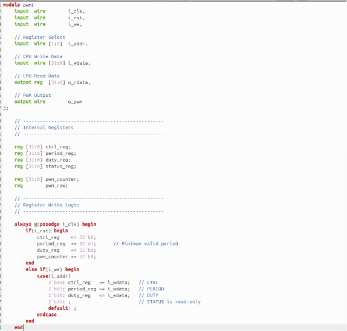

The interface consists of:

- Clock input
- Reset input
- Write enable signal
- Register address
- Write data bus
- Read data bus
- PWM output

This interface enables seamless integration with the existing SoC memory bus.

---

# Internal Registers

The PWM IP internally maintains four software-accessible registers together with the PWM counter and intermediate waveform generation logic.


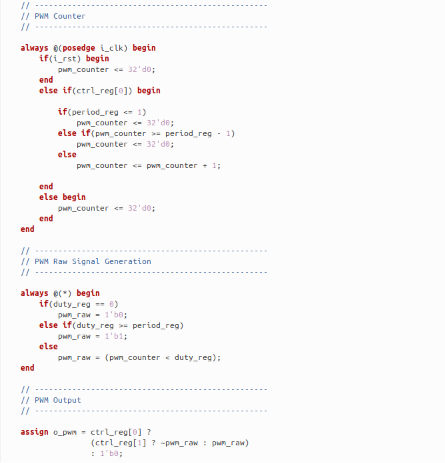


The register write logic updates the selected register whenever the write enable signal is asserted. Register selection is determined by the address lines, allowing software to independently configure the control, period, and duty cycle registers.

---

# PWM Counter and Waveform Generation

The PWM counter forms the core of the peripheral.


During operation, the counter increments on every clock cycle until the programmed period value is reached. Once the terminal count is reached, the counter resets and starts counting again, thereby generating a continuous PWM period.

The output waveform is produced by comparing the counter value against the programmed duty cycle value. When the counter remains below the duty cycle, the output stays HIGH; otherwise, it transitions LOW. This comparison determines the duty cycle of the generated PWM signal.

---

# Status Register and Read Logic

The PWM peripheral also provides a read interface for software verification.


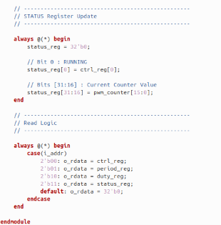


The STATUS register reports whether the PWM module is currently enabled and also provides the current value of the PWM counter. This information is useful during software testing and debugging. The read logic multiplexes the appropriate register onto the read data bus based on the selected register address, enabling firmware to verify configuration values and monitor peripheral operation.

---

# RTL Verification and Functional Simulation

After completing the RTL implementation of the PWM IP, the design was verified using a dedicated Verilog testbench. The objective of simulation was to ensure that every register, control signal, and PWM output behaved according to the specification before integrating the peripheral into the complete RISC-V SoC.

The simulation environment was created using **Icarus Verilog (iverilog)** for compilation and execution, while **GTKWave** was used to visualize and analyze the generated waveforms.

---

# Simulation Environment

The following tools were used during verification:

| Tool | Purpose |
|------|---------|
| Icarus Verilog (iverilog) | RTL Compilation and Simulation |
| VVP | Simulation Execution |
| GTKWave | Waveform Visualization |
| Verilog Testbench | Functional Verification |

The verification process ensured that all programmable registers and PWM logic operated correctly under different operating conditions.

---

# Compiling the Design

The first step involved compiling both the PWM RTL module and its corresponding testbench.

The following command was used:

```bash
iverilog -o pwm_sim tb_pwm.v pwm.v
```

This command compiles the PWM RTL (`pwm.v`) together with the verification testbench (`tb_pwm.v`) and generates an executable simulation file named `pwm_sim`.

---

### Figure 5 – RTL Compilation

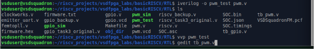

The compilation completed successfully, indicating that the RTL module and testbench were syntactically correct and ready for simulation.

---

# Running the Simulation

After successful compilation, the generated simulation executable was executed using:

```bash
vvp pwm_sim
```

The simulator applies various test cases to the PWM module and prints the verification results on the terminal.

---

### Figure 6 – Simulation Execution

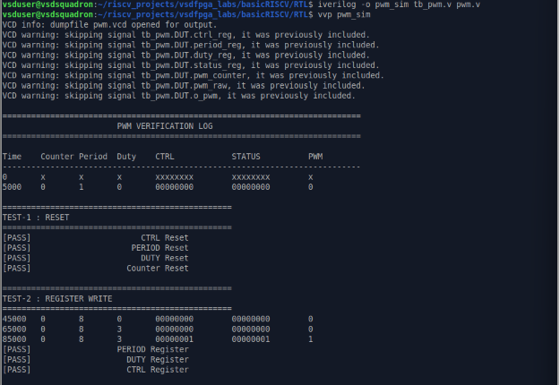

The simulation log displays the execution of different verification tests along with their PASS status.

Each test verifies a specific functional aspect of the PWM peripheral.

---

# Functional Verification

The PWM module was validated using a comprehensive set of test cases covering register initialization, register writes, register reads, waveform generation, boundary conditions, polarity inversion, disable operation, and status register functionality.

---

## Test 1 – Reset Verification

During reset, all programmable registers should return to their default values.

The following registers were verified:

- CTRL Register
- PERIOD Register
- DUTY Register
- PWM Counter

Expected Behaviour:

- CTRL = 0
- PERIOD = Default Value
- DUTY = 0
- Counter = 0

The simulation successfully confirmed correct reset behaviour.

---

## Test 2 – Register Write Verification

This test verifies that software can correctly configure the PWM registers.

The following operations were performed:

- Write PERIOD Register
- Write DUTY Register
- Write CTRL Register

Each register was subsequently read back to ensure the written values were correctly stored.

---

### Figure 7 – Register Write Verification


The successful PASS messages indicate that all writable registers correctly accepted and stored the programmed values.

---

## Test 3 – Register Read Verification

After programming the registers, the testbench performed read operations to verify that each register returned the expected value.

The following registers were validated:

- CTRL
- PERIOD
- DUTY
- STATUS

---

### Figure 8 – Register Read Verification

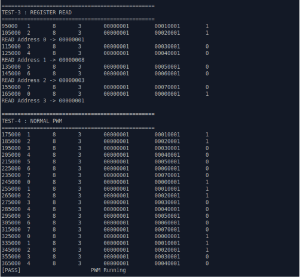

The returned values exactly matched the programmed register contents, confirming correct read functionality.

---

## Test 4 – PWM Generation

Once the PWM module was enabled, the internal counter started incrementing from zero up to the programmed period value.

The output waveform was generated by continuously comparing the current counter value with the duty cycle register.

Whenever:

```
Counter < Duty
```

the PWM output remained HIGH.

Otherwise,

```
Counter ≥ Duty
```

the output transitioned LOW.

This generated the expected PWM waveform.

---

## Test 5 – Duty Cycle = 0

The duty register was programmed with zero.

Expected Behaviour:

- PWM output remains LOW throughout the entire period.

The simulation confirmed this behaviour successfully.

---

## Test 6 – Duty Cycle = Period

The duty cycle was programmed equal to the programmed period value.

Expected Behaviour:

- PWM output remains HIGH throughout the entire period.

The generated waveform matched the expected output.

---

## Test 7 – Duty Cycle Greater than Period

To evaluate boundary behaviour, the duty cycle was programmed with a value greater than the configured period.

The simulation verified that the PWM module handled this condition correctly without generating unexpected behaviour.

---

### Figure 9 – Duty Cycle Verification

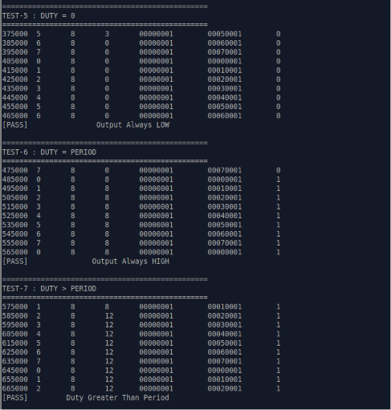

The verification log confirms successful execution of all duty-cycle boundary tests.

---

## Test 8 – Polarity Control

The polarity control bit inside the CTRL register was enabled.

When enabled, the generated PWM waveform is inverted.

This feature allows the same PWM peripheral to support active-high as well as active-low output devices.

The simulation confirmed successful polarity inversion.

---

## Test 9 – Disable Operation

Finally, the PWM module was disabled by clearing the enable bit.

Expected Behaviour:

- PWM counter stops.
- PWM output becomes inactive.

The simulation confirmed that disabling the PWM module immediately stopped waveform generation.

---

## Test 10 – Status Register Verification

The STATUS register was read continuously during operation.

The following information was verified:

- Running status bit
- Current counter value

The counter value increased continuously while the PWM module remained enabled, demonstrating correct runtime operation.

---

### Figure 10 – Final Verification Results

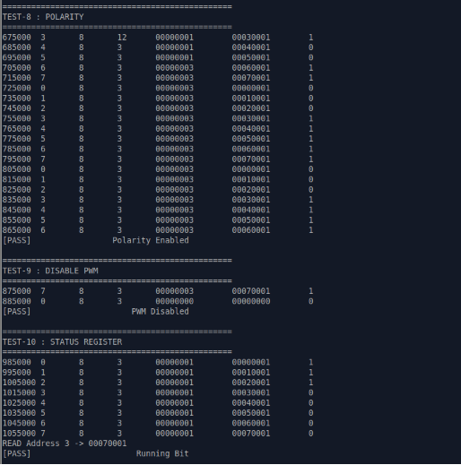
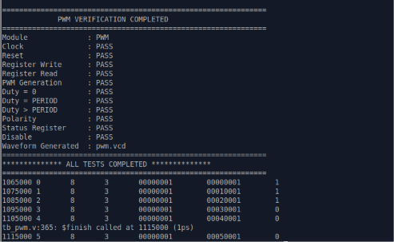

The verification summary indicates that every functional test completed successfully.

---

# Waveform Analysis

After simulation, a Value Change Dump (VCD) file was generated.

This waveform was analyzed using GTKWave to observe the internal operation of the PWM module.

The waveform contains:

- Clock Signal
- Reset Signal
- Register Address
- Write Enable
- Write Data
- PWM Counter
- CTRL Register
- PERIOD Register
- DUTY Register
- STATUS Register
- PWM Output

---

### Figure 11 – Initial GTKWave Analysis

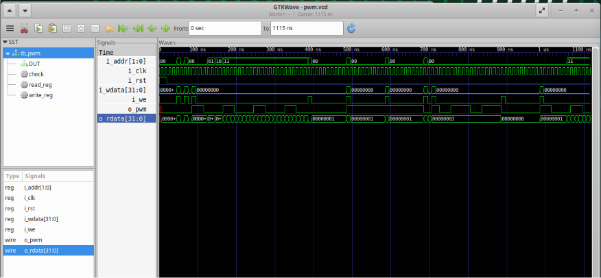
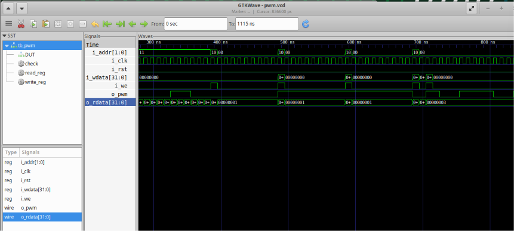

The waveform shows the register programming sequence and corresponding updates in the internal signals.

---

### Figure 12 – Complete PWM Waveform

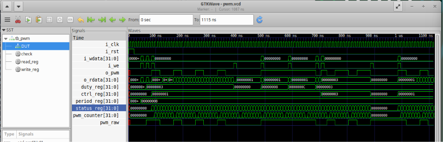

The waveform confirms that:

- Register writes occur correctly.
- PWM counter increments continuously.
- PWM output changes according to the programmed duty cycle.
- STATUS register reflects the internal counter value.

The successful simulation demonstrates that the PWM IP operates correctly at the RTL level and is ready for integration into the RISC-V SoC.

# SoC Integration

After verifying the PWM IP independently through simulation, the next stage involved integrating the peripheral into the existing RISC-V based System-on-Chip (SoC). The integration allows software executing on the processor to communicate with the PWM hardware using memory-mapped I/O transactions.

Unlike standalone RTL verification, SoC integration demonstrates how the processor, memory subsystem, and hardware peripherals interact as a complete embedded system.

---

# PWM Integration into the SoC

The PWM peripheral was added as an independent hardware module within the SoC architecture. The integration required modifications to the top-level SoC (`riscv.v`) so that the processor could access the PWM registers through the system memory bus.

The integration process involved the following steps:

- Including the PWM RTL module.
- Defining a dedicated memory-mapped address region.
- Generating write-enable signals.
- Selecting the appropriate register using address decoding.
- Instantiating the PWM peripheral.
- Connecting the PWM read data back to the processor.

The overall data flow is shown below.

```
               +----------------------+
               |   RISC-V Processor   |
               +----------+-----------+
                          |
                    Memory Bus
                          |
        ------------------------------------
        |                                  |
        |                                  |
      RAM                          Memory Mapped I/O
                                           |
                                  +-----------------+
                                  |     PWM IP      |
                                  +-----------------+
                                           |
                                      PWM Output
                                           |
                                      FPGA RGB LED
```

---

# Including the PWM Module

The first integration step was to include the PWM RTL module inside the SoC source file.

```verilog
`include "pwm.v"
```

This makes the PWM module available during synthesis and allows it to be instantiated within the SoC.

---

## Figure 13 – PWM Module Included


---

# Memory-Mapped Addressing

The SoC uses memory-mapped I/O to communicate with hardware peripherals.

Whenever the processor accesses an address located within the I/O region, the corresponding peripheral is selected instead of RAM.

A dedicated address region was assigned to the PWM peripheral.

The processor accesses the PWM registers simply by performing normal read and write operations.

This eliminates the need for any special communication protocol and provides a simple software programming model.

---

# PWM Write Enable Generation

The PWM peripheral should respond only when software performs a write operation to its assigned address space.

To accomplish this, a dedicated write-enable signal was generated.

```verilog
assign pwm_we =
    isIO &
    mem_wstrb &
    mem_wordaddr[IO_PWM_bit];
```

This signal becomes active only when:

- The accessed address belongs to the I/O region.
- A memory write operation is requested.
- The selected peripheral corresponds to the PWM IP.

---

## Figure 14 – PWM Address Decoding

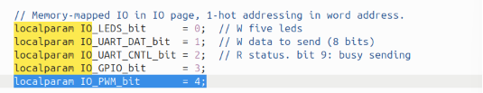
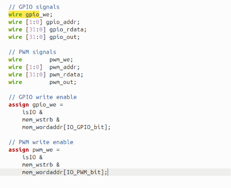

The address decoder ensures that write requests intended for other peripherals do not affect the PWM registers.

---

# Register Selection

Each PWM register occupies a separate word offset inside the PWM address space.

The register selection logic uses the lower address bits.

```verilog
assign pwm_addr = mem_addr[3:2];
```

These address bits determine which internal register is accessed.

| Address Offset | Register |
|---------------|----------|
| 0x00 | CTRL |
| 0x04 | PERIOD |
| 0x08 | DUTY |
| 0x0C | STATUS |

---

# PWM Module Instantiation

After generating the necessary interface signals, the PWM peripheral was instantiated within the SoC.

The instance connects:

- Clock
- Reset
- Write Enable
- Register Address
- Write Data
- Read Data
- PWM Output

to the system bus.

---

## Figure 15 – PWM Module Instantiation

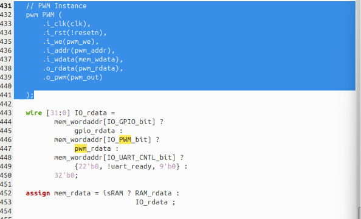

This modular approach makes the PWM peripheral reusable in future designs with minimal changes.

---

# Read Data Multiplexer

Multiple peripherals share the same processor read-data bus.

Therefore, the SoC uses a multiplexer to return data from the correct peripheral.

The PWM read data is selected whenever the processor accesses the PWM address space.

```verilog
wire [31:0] IO_rdata =
       mem_wordaddr[IO_GPIO_bit] ?
           gpio_rdata :
       mem_wordaddr[IO_PWM_bit] ?
           pwm_rdata :
       ...
```

This allows software to read the CTRL, PERIOD, DUTY and STATUS registers exactly like ordinary memory locations.

---

## Figure 16 – Read Data Multiplexer


---

# Firmware Development

After completing hardware integration, firmware was developed to validate the PWM peripheral.

The firmware communicates with the hardware through memory-mapped I/O registers defined inside `io.h`.

Each register is assigned a fixed offset from the peripheral base address.

The firmware configures the PWM module by writing values into:

- CTRL Register
- PERIOD Register
- DUTY Register

and verifies operation by reading back the programmed values.

---

# Software Verification Procedure

The firmware executes a sequence of verification tests covering both register functionality and peripheral operation.

The following tests are performed:

- Verification of default register values
- PERIOD register programming
- DUTY register programming
- CTRL register programming
- STATUS register verification
- Boundary testing
- Continuous counter monitoring
- Disable operation
- PASS/FAIL summary generation

Each test compares the expected register value with the actual value returned by the peripheral.

This provides confidence that both the software interface and the hardware implementation operate correctly.

---

## Figure 17 – PWM Test Firmware


The firmware demonstrates how software running on the RISC-V processor can configure and validate the PWM peripheral entirely through memory-mapped register accesses.

---

# Firmware Execution Flow

The overall execution sequence is illustrated below.

```
System Reset
      │
      ▼
Read Default Registers
      │
      ▼
Program PERIOD Register
      │
      ▼
Program DUTY Register
      │
      ▼
Enable PWM
      │
      ▼
Read STATUS Register
      │
      ▼
Monitor Counter
      │
      ▼
Disable PWM
      │
      ▼
Display PASS/FAIL Results
```

This sequence validates the complete hardware-software interaction between the processor and the PWM peripheral.

---

## Figure 18 – Firmware Execution

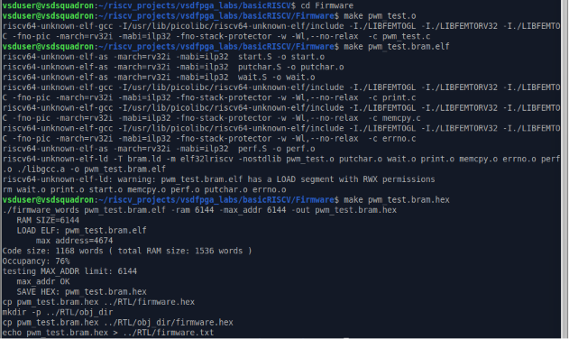

The successful execution of the firmware confirms that the processor can configure the PWM peripheral, access its registers, and monitor its operation through the memory-mapped interface.

# FPGA Implementation

After successful RTL verification and software validation, the complete SoC containing the integrated PWM peripheral was synthesized and programmed onto the **VSDSquadron FM FPGA board** based on the **Lattice iCE40UP5K FPGA**.

The FPGA implementation verifies that the designed hardware operates correctly on real hardware rather than only in simulation.

The implementation flow consists of synthesis, place-and-route, bitstream generation, and FPGA programming.

---

# FPGA Development Flow

The following design flow was followed during hardware implementation.

```
Verilog RTL
      │
      ▼
Yosys Synthesis
      │
      ▼
NextPNR Place & Route
      │
      ▼
Bitstream Generation
      │
      ▼
iceprog
      │
      ▼
VSDSquadron FM FPGA
      │
      ▼
PWM Output on RGB LED
```

The RTL design was first synthesized using **Yosys**, followed by place-and-route using **NextPNR**. The generated bitstream was then programmed onto the FPGA using **iceprog**.

---

# Build Process

The project Makefile automates the complete FPGA compilation flow.

The build command performs the following tasks:

- RTL synthesis
- Logic optimization
- Place and Route
- Timing Analysis
- Bitstream generation

The following command was used:

```bash
make build
```

---

# Programming the FPGA

After successful synthesis, the generated bitstream was programmed into the FPGA.

```bash
sudo make flash
```

This transfers the generated bitstream into the VSDSquadron FM board, allowing the PWM hardware to execute on the FPGA.

---

# Hardware Validation

After successful synthesis and FPGA programming, the PWM peripheral was validated on the **VSDSquadron FM FPGA board**.

The firmware configured the PWM peripheral through memory-mapped registers by programming different duty-cycle values while keeping the PWM period constant. The generated PWM output was routed to the onboard RGB LED to demonstrate hardware operation.

The hardware validation confirms that:

- The RISC-V SoC was successfully programmed onto the FPGA.
- The PWM peripheral was correctly integrated with the SoC.
- Software was able to configure the PWM registers through memory-mapped I/O.
- The generated PWM signal was successfully routed to the onboard RGB LED.
- Changing the duty cycle altered the LED output, demonstrating correct PWM operation on hardware.

### PWM Output with 20% Duty Cycle

The firmware configured the PWM duty cycle to **20%**, resulting in a shorter HIGH duration during each PWM period. This represents a lower duty-cycle configuration.


---

### PWM Output with 80% Duty Cycle

The firmware was then updated to configure the PWM duty cycle to **80%**, increasing the HIGH duration within each PWM period and demonstrating successful software control of the PWM output.

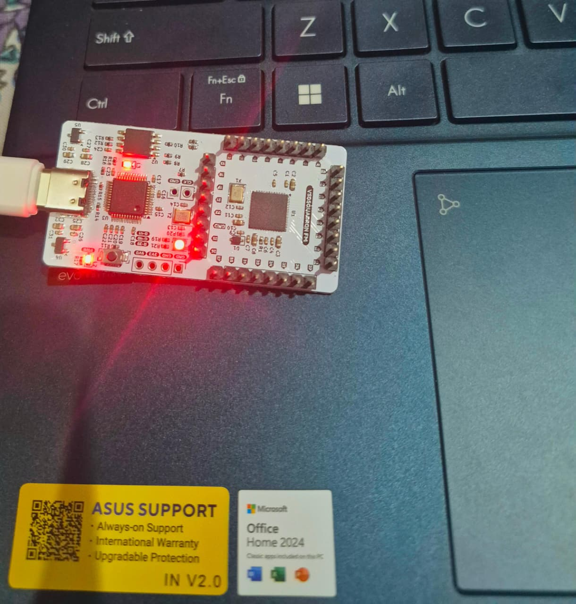

---

# Project Directory Structure

The final project organization is shown below.

```
ip/
└── pwm/
    ├── rtl/
    │   ├── pwm.v
    │   └── riscv.v
    │
    ├── test/
    │   ├── pwm_test.c
    │   ├── tb_pwm.v
    │   └── pwm.vcd
    │
    ├── screenshots/
    │   ├── screen1.png
    │   ├── screen2.png
    │   ├── ...
    │   └── screen18.png
    │
    └── README.md
```

Maintaining a structured project hierarchy improves readability, simplifies maintenance, and allows the IP to be reused in future projects.

---

# Files Description

| File | Description |
|------|-------------|
| `pwm.v` | RTL implementation of the PWM peripheral |
| `riscv.v` | Integration of the PWM IP into the RISC-V SoC |
| `tb_pwm.v` | Verilog testbench used for functional verification |
| `pwm_test.c` | Firmware used to validate the PWM peripheral |
| `io.h` | Memory-mapped register definitions |
| `README.md` | Project documentation |

---

# Key Features Implemented

The developed PWM IP includes the following features:

- Memory-mapped peripheral interface
- Configurable PWM period
- Configurable duty cycle
- Enable and Disable control
- Status register for software monitoring
- Modular RTL implementation
- RISC-V SoC integration
- Functional simulation
- FPGA hardware implementation

---

# Challenges Encountered

During the development process, several engineering challenges were addressed, including:

- Designing a reusable memory-mapped peripheral.
- Integrating the peripheral into the existing SoC bus architecture.
- Implementing correct register decoding.
- Verifying communication between firmware and hardware.
- Debugging RTL behaviour through simulation.
- Validating the design on FPGA hardware.

Each stage helped improve understanding of the complete hardware development workflow, from RTL implementation to physical deployment.

---

# Learning Outcomes

This project provided practical experience in several important areas of digital system design, including:

- RTL design using Verilog HDL.
- Design of memory-mapped hardware peripherals.
- Register-based hardware interfaces.
- Hardware/software co-design.
- RISC-V SoC architecture.
- Functional verification using Verilog testbenches.
- Waveform debugging using GTKWave.
- FPGA synthesis and implementation flow.
- Real hardware validation on the VSDSquadron FM platform.

The project also strengthened understanding of the interaction between embedded software and hardware peripherals through memory-mapped I/O.

---

# Future Improvements

Although the current implementation provides the required functionality, several enhancements can be incorporated in future versions:

- Multi-channel PWM generation.
- Runtime frequency configuration.
- Interrupt generation on counter overflow.
- Dead-time insertion for motor-control applications.
- Higher resolution duty-cycle control.
- Multiple programmable operating modes.
- APB or AXI-Lite compatible interface for larger SoC integration.

These improvements would make the PWM IP suitable for more advanced embedded and industrial applications.

---

# Conclusion

In this project, a configurable PWM IP core was successfully designed, implemented, verified, and integrated into an existing RISC-V SoC.

The RTL implementation provides programmable control over the PWM period and duty cycle through memory-mapped registers, enabling software running on the RISC-V processor to configure the peripheral dynamically.

The design was functionally verified through simulation using Icarus Verilog and GTKWave before being integrated into the complete SoC. Finally, the complete system was synthesized and programmed onto the VSDSquadron FM FPGA board, demonstrating successful hardware implementation.

The project illustrates the complete hardware development workflow, beginning with RTL design and ending with FPGA deployment, while highlighting the interaction between embedded software and custom hardware peripherals.

---

# References

1. RISC-V Unprivileged ISA Specification
2. Verilog HDL Documentation
3. VSDSquadron FM Documentation
4. Yosys Open Synthesis Suite
5. NextPNR Place and Route Tool
6. GTKWave Waveform Viewer
7. Icarus Verilog Simulator

---

# Acknowledgements

This project was completed as part of the **VSD RISC-V Core Contributor Internship Program**, providing practical exposure to RTL design, IP development, SoC integration, simulation, and FPGA implementation.
